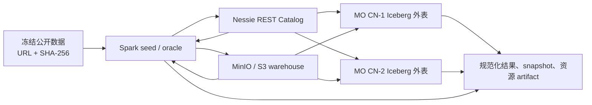

# Iceberg 外部表功能测试设计（Issue #23359）

## 1. 背景与目标

Issue [#23359](https://github.com/matrixorigin/matrixone/issues/23359) 为 MatrixOne（MO）新增通过 Iceberg REST Catalog 查询和写入外部 Apache Iceberg 表的能力。本设计以研发评论附带的《MatrixOne Iceberg 用户指南》和《MatrixOne Iceberg 公开数据集测试指南》为验收契约；文档记录的实现基线为 PR #25368、合入提交 `b3fe1ba62922`，实际执行必须改用测试当日最新 official `main` 40 位 SHA，不将 Iceberg 规范中尚未承诺的能力纳入通过标准。

测试的核心不是验证某条 SQL 返回成功，而是证明 MO 与 Spark 在**同一 catalog、warehouse、ref 和 snapshot**上观察到一致的数据和元数据；所有失败路径必须保持外表映射、远端 snapshot 和对象引用的原子性。

本文件是测试设计，不记录执行结论。实际测试记录必须填写真实的 `main` 40 位 commit、环境、数据哈希、snapshot、日志或 CI artifact 后，才能给出通过/不通过结论。

### 1.1 已支持范围

| 范围 | 本轮正向验收 |
| --- | --- |
| Catalog | Iceberg REST / `native-rest`；Nessie 作为 REST Catalog 实现 |
| 格式和文件 | format v1/v2 读取；format v2 写入和行级 DML；Parquet data file |
| 读取类型 | boolean、int/long、float/double、decimal、date、timestamp/timestamptz、string、binary |
| 分区 | 读取和安全剪枝：identity、year/month/day/hour、bucket、truncate；写入：identity、时间/日期 year/month/day、时间 hour |
| 读取语义 | append-only、position/equality delete 的 merge-on-read、snapshot/timestamp/ref time travel |
| 写入与维护 | INSERT、INSERT OVERWRITE、DELETE、UPDATE、MERGE、rewrite data files/manifests、expire snapshots |
| 协作 | Nessie branch/tag/hash/snapshot 读取；branch 写入；与 Spark（可选 Trino）交叉验证 |

### 1.2 明确不作为正向能力验收

以下项目必须以稳定的 `unsupported` 类错误拒绝，且不得 panic、hang、OOM、静默丢数据或泄漏敏感信息：Iceberg v3/v4、Avro/ORC data file、`time`/`uuid`/`fixed`/`struct`/`list`/`map`/geometry 等嵌套或未支持类型、deletion vector、bucket/truncate 分区写入、自动 orphan GC、delete spill、`enable-per-account=true`、tag/hash/snapshot 的普通写入。

### 1.3 验收时不能误判的当前行为

- `write_mode=read_only` 会阻止 INSERT append；当前 OVERWRITE、DELETE、UPDATE、MERGE runtime 只强制检查全局 DML feature flags，尚未再次强制检查表级 `write_mode`。因此表级 mode 不能单独作为行级 DML 安全边界，相关用例必须同时验证 MO SQL 权限和全局开关。
- `SHOW ICEBERG NAMESPACES/TABLES` 只列出 MO 本地 mapping，不会实时枚举远端 Catalog。远端存在但未映射的表不显示是当前正确行为。
- `manifest-cache-bytes=0`、cache TTL/timeout/memory 等零值会恢复默认值，不代表关闭限制。
- 写入和维护是“先写对象、后提交 metadata”。commit 前失败产生的不可达对象可以登记为 orphan，但不得出现在任何有效 snapshot/ref；当前不会自动物理删除 orphan。
- `commit unknown` 不是提交失败的同义词。只有根据 idempotency key、snapshot summary、publish/maintenance job 核验后，才能决定是否重试。

## 2. 测试策略

### 2.1 通过判定与 Oracle

1. Spark Iceberg 客户端是主 oracle；可用时增加 Trino 作为第三 oracle。
2. 对账前先确认 `catalog URI + warehouse + namespace.table + ref + snapshot ID` 完全一致；不同 snapshot 的结果不得直接比较。
3. 有序结果必须提供完整稳定的 `ORDER BY`；decimal 统一 CAST，浮点统一 ROUND/容差，timestamp 固定会话时区，NULL/NaN/正负零的输出规则写入 case metadata。
4. 成功写入必须验证：一次 Catalog commit、affected rows、MO/Spark 可见性、data/delete/manifest 变化、目标范围完整且非目标范围不变。
5. 失败 DDL 必须验证未创建本地 mapping；失败写入必须复查 ref/snapshot、完整行集、被引用对象集合和 publish/maintenance/orphan 状态。允许存在的失败产物只能是已登记且不被任何 snapshot/ref 引用的 orphan。
6. 每次读取都检查完整列数、类型、NULL、缺失/重复/陈旧行；不以进程退出码、单个 COUNT 或裸 `PASS` 代替结果正确性。
7. 常规功能用例至少连续执行 3 次；并发、超时、cache 和资源场景执行 10–20 次，并在适用的 Go 生命周期路径执行 `-race`。

### 2.2 分层与数据

| 层级 | 数据/拓扑 | 目的 | 频率 |
| --- | --- | --- | --- |
| T0 本地确定性 | 小型自建 v1/v2 表，Nessie + MinIO + MO + Spark | DDL、类型、错误契约、写入/DML 原子性 | 每个 Iceberg PR |
| T1 公开数据 smoke | NYC TLC Yellow Taxi 2024-01，单次 seed 200,000 行 | 真正 Iceberg 表的 mapping 与四类同 snapshot 对账；无 ORDER BY 的 LIMIT 不作为跨 run golden | 每日/PR advisory |
| T2 nightly | NYC TLC 2024-01 全月 + 可写副本 | 完整读取、time travel、schema/delete/ref 和跨引擎写入 | nightly required |
| T3 周期扩展 | NOAA 固定年份、ClickBench 单/100 文件、small-files 表 | 多分区、性能、规划与维护 | weekly / release |
| T4 负向兼容 | Overture Maps 固定 release 小切片或等价自建 nested table | 不支持类型/格式的 fail-fast 与脱敏 | 版本升级 / release |

每次公开数据运行必须生成 dataset manifest：固定 URL、下载 UTC 时间、文件大小、SHA-256、源 schema、`source_license`（许可证/署名/限制）、seed SQL 哈希、Spark/Iceberg/JDK 版本、format version、partition spec、table UUID、ref、snapshot、row count、各类文件计数和脱敏后的 metadata location hash。URL 相同但 SHA-256 变化即视为新数据版本。

公开输入必须固定为可追溯对象：

- NYC 主基线：`https://d37ci6vzurychx.cloudfront.net/trip-data/yellow_tripdata_2024-01.parquet`。
- ClickBench：`https://datasets.clickhouse.com/hits_compatible/hits.parquet`，以及 `https://datasets.clickhouse.com/hits_compatible/athena_partitioned/hits_0.parquet` 至 `hits_99.parquet` 的每个文件。
- NOAA：从 `https://www.ncei.noaa.gov/pub/data/ghcn/daily/by_year/` 选择并记录实际年份文件，不能使用 `latest`。
- Overture：`s3://overturemaps-us-west-2/release/<固定-release>/theme=places/type=place/*`，执行时必须替换为实际 release、固定 bbox 和对象清单，并保存随数据交付的许可证和署名文本。

任何输入都以完整下载得到的 SHA-256 为准，ETag 和 Content-Length 只能作为辅助信息。

公开数据只作为可追溯原始输入，不能依赖第三方公开 Iceberg REST Catalog 持续可用；所有 seed 后的 Iceberg metadata、snapshot、Nessie ref 和对象存储均由测试环境控制。

NYC seed 必须显式 cast 到研发指南的 19 列 schema，不依赖 Parquet 推断类型：`vendor_id`、`tpep_pickup_datetime`/`tpep_dropoff_datetime` timestamptz、`passenger_count`、`trip_distance`、`rate_code_id`、`store_and_fwd_flag`、`pu_location_id`、`do_location_id`、`payment_type`，以及 `fare_amount`、`extra`、`mta_tax`、`tip_amount`、`tolls_amount`、`improvement_surcharge`、`total_amount`、`congestion_surcharge`、`airport_fee` 9 个 `DECIMAL(12,2)` 金额列。本地 mapping 中 timestamptz 对应 `TIMESTAMP(6)`；另建 Iceberg 无时区 timestamp fixture 验证其对应 `DATETIME(6)`。

### 2.3 推荐拓扑与前置条件



- 本地联调允许 `MO_ICEBERG_ALLOW_PLAIN_HTTP=1`；生产/发布验收必须使用 HTTPS。
- CN 至少开启 `[cn.frontend.iceberg] enable=true`。写入、DML、维护场景仅打开相应的 `enable-write`、`enable-delete`、`enable-dml`、`enable-maintenance` 开关；`enable-delete-spill`、`enable-orphan-gc`、`enable-per-account` 保持关闭。
- 创建 Catalog 后，按最小权限为测试身份建立 `iceberg_register_access` principal mapping 与 residency policy；禁止把 access key、secret、bearer token、签名 URL 或原始敏感路径写入 SQL、日志和 artifact。
- 读基线外表使用 `read_mode=merge_on_read`，以覆盖 delete file；对照只读权限使用 `write_mode=read_only`。可写测试必须使用独立的 format v2 副本和 run-id 命名的 namespace/ref，避免污染冻结基线或并行任务。
- PR 级 T0/T1 可使用单 CN；发布候选必须至少使用 2 个 CN，通过同一 proxy 轮询连接，验证跨 CN cache、credential 和提交可见性。

资源边界测试使用以下研发默认值作为基线，并在执行报告保存实际加载配置：

| 配置组 | 默认值 |
| --- | --- |
| manifest cache | 256 MiB、TTL 5m、read parallelism 8 |
| planning | max manifests 100,000；max data files 1,000,000；memory 256 MiB；mode auto；timeout 30s |
| delete / DML | delete memory 256 MiB；DML memory 256 MiB；delete spill false |
| orphan | TTL 24h；auto GC false |
| REST / signed HTTP 内置边界 | request timeout 30s；REST body 32 MiB；`/config` cache 1024 项/16 MiB；非流式 signed HTTP 512 MiB |

## 3. 功能测试用例

### 3.1 配置、Catalog 与访问控制

| ID | P | 场景与操作 | 预期与断言 |
| --- | --- | --- | --- |
| ICE-CAT-001 | P0 | 仅开启 `enable`，使用含 IF NOT EXISTS 的 CREATE `rest`/`native-rest` Catalog、access/residency、外表 mapping，执行 `SHOW/SHOW CREATE` 与基础查询；另建省略 ref/read/write mode 的 mapping | 两种同义 type 行为一致；Catalog、mapping 和系统表可见；幂等 DDL 不重复建记录；默认值为 main/append_only/read_only；敏感值不回显；MO/Spark 同 snapshot 的 COUNT 一致 |
| ICE-CAT-002 | P0 | 分别关闭 `enable`、使用 HTTP Catalog/signer（未设置开发开关）、明确使用 `iceberg-go` 或其他不支持 type；mapping 缺 catalog/namespace/table、unknown/空/重复 option、非法 read/write mode | stable `ICEBERG_FEATURE_DISABLED` / config/validation 错误；无网络副作用、本地 mapping 或远端对象 |
| ICE-CAT-003 | P0 | 缺失 principal mapping、错误 endpoint/region/bucket、失效/缺失 credential、虚报 remote-signing capability | 分别返回 principal/residency/credential/signing 类错误；不可通过放宽 scope 掩盖；无 token/签名 URL 泄漏 |
| ICE-CAT-004 | P1 | ALTER Catalog 后查询；存在 mapping、policy、ref cache、job、orphan 依赖时 DROP Catalog | ALTER version 递增且新配置生效；DROP 被拒绝并列出依赖；先按生命周期清理后才允许删除 |
| ICE-CAT-005 | P1 | 多账户/角色/用户使用相同 Catalog，但只给一个主体授权 | 授权主体可访问，其他主体 fail closed；不得跨账户/角色读取同一外部数据 |
| ICE-CAT-006 | P1 | 覆盖 cache bytes/TTL、manifest parallelism、file/planning/delete/DML memory 与 timeout、orphan TTL 的默认/零值/非法值；`server-planning-mode=off/auto/required` 与 `server_side_planning` capability；remote-signing/protected-CN flags 与实际 capability 不一致 | off 走本地、auto 可回退、required 不可用时失败；零值恢复研发文档默认值；非法 duration/开启 delete spill/orphan GC 在 CN 配置校验阶段拒绝；配置 flag 不能绕过 capability/residency/受保护 RPC |
| ICE-CAT-007 | P1 | `token_secret_ref` 的 `secret://` 合法引用、错误 scheme、缺失、轮换、对应环境变量名及明文 token；`capabilities_json` 对象/数组/非法值；SHOW 全语法、LIKE/WHERE、远端未映射表 | 只保存/回显 secret 引用而非值；resolver 名称转换正确，缺 secret/错误 scheme 明确失败；capability 解析符合契约；SHOW 只列本地 mapping，LIKE/WHERE 拒绝 |
| ICE-CAT-008 | P1 | `iceberg_register_access` 的 account/role/user、`scope_type=account/cluster`、`policy_state=enabled/disabled/audit`、option alias、值内逗号及普通租户跨账户/cluster scope | 合法组合返回 operation/status/principal/scope；disabled 不授权，audit 不扩大 residency；sys 与普通租户权限隔离；非法 scope、全零 role/user、含未转义逗号的值稳定拒绝且不留 policy |
| ICE-CAT-009 | P1 | 本地 Catalog/signer 使用 HTTP，分别设置大小写混合的 `1/true/yes/on`、false、空值和未设置 `MO_ICEBERG_ALLOW_PLAIN_HTTP` | 仅文档声明的 true 值允许本地 HTTP；其他值均按生产安全默认拒绝；Catalog 与 signer 校验一致 |

### 3.2 Mapping、类型与基础读取

| ID | P | 场景与操作 | 预期与断言 |
| --- | --- | --- | --- |
| ICE-READ-001 | P0 | v1/v2 Parquet 表映射全量 primitive schema，MO 与 Spark 执行 COUNT、定时范围 COUNT/SUM、稳定排序投影、GROUP BY、每列 NULL count/min/max | 行数、逐行投影、NULL、decimal、timestamp、聚合 key/count/sum/avg/min/max 一致 |
| ICE-READ-002 | P0 | v2 表中包含单个/多个 position delete 与 equality delete，覆盖多 data file、重复 equality key、未命中 delete；在全局 `enable-delete=false` 时分别以 `append_only`、`merge_on_read` 映射查询 | append-only 明确拒绝 delete manifest；merge-on-read 仍能读取并与 Spark 一致，证明行级 DML 写门禁不影响 delete file 读取；已删除行绝不返回，未命中和重复 delete 不误删 |
| ICE-READ-003 | P1 | boolean/int/long/float/double/decimal(含 precision 1、18、38)/date/timestamp/timestamptz/string/binary 的 NULL、边界与典型值 | MO 类型和值符合映射；浮点按约定容差，decimal scale、微秒精度及 session timezone 无偏移 |
| ICE-READ-004 | P1 | 本地列漏列、多列、错误类型、大小写可匹配与大小写歧义；远端 rename 后保留 field ID | 不存在/歧义列拒绝；正确 mapping 使用 field ID 而非 Parquet 列序；不能按旧列名错配 |
| ICE-READ-005 | P1 | 映射上执行 SELECT、DROP TABLE；映射不存在远端表；尝试 TRUNCATE、CREATE TABLE LIKE、CREATE INDEX 和通过本地 DDL 删除/创建远端表 | SELECT/本地 DROP 行为正确，远端数据及 snapshot 不变；not-found 和未支持语句稳定拒绝，失败 mapping 不在本地残留或远端建表 |
| ICE-READ-006 | P1 | 空表、空 data file、全 NULL/NULL-heavy、高低基数、倾斜、重复值，以及 NYC 的负金额、零距离和异常 passenger count | MO/Spark 完整对账一致；不得做隐式业务清洗、丢弃异常值或把空表错误当成读取失败 |
| ICE-READ-007 | P1 | text/binary protocol 下执行 PREPARE/EXECUTE/DEALLOCATE SELECT；覆盖 projection/filter/aggregate/JOIN 本地表/CTE/subquery/window；外部 commit 后复用 statement | 结果、列类型、NULL 和 parameter/result metadata 正确；snapshot 更新后不得复用陈旧 plan；非法 marker 不污染 statement/cache |
| ICE-READ-008 | P0 | metadata JSON、manifest list、manifest、data/delete file 缺失、截断或损坏；Parquet field ID/schema 不一致 | 返回可定位到层级的稳定错误；不得返回部分结果、panic 或无限重试；reader/HTTP body/ObjectIO 引用释放 |
| ICE-READ-009 | P1 | 多级 namespace；catalog/table/column 使用关键字、大小写、引号、标点、中文和内部风格名称 | 合法标识符可映射、SHOW 和查询；大小写歧义或非法名称明确拒绝；不同对象不串 mapping/cache |

### 3.3 规划、剪枝与时间旅行

| ID | P | 场景与操作 | 预期与断言 |
| --- | --- | --- | --- |
| ICE-PLAN-001 | P0 | identity/year/month/day/hour/bucket/truncate 分区表，针对等值、范围、IN、无关谓词执行查询 | 结果与 Spark 一致；保守多读可接受，任何漏行即失败；EXPLAIN 显示 Iceberg scan/ref/snapshot，并保存 task/data-file/manifest 数 |
| ICE-PLAN-002 | P1 | 有 data-file lower/upper bound、NULL/NaN count、row-group 的表执行 projection/filter | 结果正确；计划可做安全 prune，residual predicate 仍执行；不得因统计不完整漏读 |
| ICE-PLAN-003 | P0 | Spark append 后记录 snapshot；MO 使用 `FOR ICEBERG SNAPSHOT`、`TIMESTAMP AS OF` | 当前 snapshot 看到新行，旧 snapshot 的 count/checksum 不变；timestamp 选择该时间点前最新 snapshot |
| ICE-PLAN-004 | P1 | snapshot ID 为 0/负数/溢出/非 literal/不存在；timestamp 早于 epoch或此前无 snapshot；无效 ref；Iceberg time travel 与 MO native snapshot hint 并用 | 明确拒绝，且不影响当前 mapping/cache |
| ICE-PLAN-005 | P1 | 冷 cache 与热 cache 重复查询；设置合理短 TTL 后由 Spark 提交新 snapshot | 同一 snapshot 的结果一致；revalidation 后看到外部提交；不允许 cache 永久陈旧 |
| ICE-PLAN-006 | P1 | 分区源值覆盖 NULL、负/epoch 前日期、闰日、year/month/day/hour 边界，并在 UTC 与 Asia/Shanghai 会话时区切换 | partition transform 与 residual filter 的结果均与 Spark 一致；未知/不可证明的 transform 保守保留文件 |
| ICE-PLAN-007 | P0 | CN-1 写入或 Spark 外部 commit 后，经 proxy 在 CN-1/CN-2 交替查询；并发访问不同 ref | 本 CN 主动失效、其他 CN 在 revalidation/TTL 后看到新 snapshot；任何时刻不得把另一个 ref 的 snapshot 或结果串入 |

### 3.4 Schema/partition evolution 与跨引擎可见性

| ID | P | 场景与操作 | 预期与断言 |
| --- | --- | --- | --- |
| ICE-EVO-001 | P0 | Spark add nullable column；对演进前、后 snapshot 各做 count/checksum/样本投影 | 新列在旧行显示 NULL；前后 snapshot 各自结果正确 |
| ICE-EVO-002 | P1 | Spark rename column（field ID 不变）、drop 列后同名新增列 | rename 后读取原 field 数据；同名新列不得复活旧 field 数据 |
| ICE-EVO-003 | P1 | partition spec 从 month 演进到 day，追加新数据并按月/日过滤 | 新旧 spec 同时正确读取、没有丢行；剪枝仅作为附加证据 |
| ICE-EVO-004 | P0 | Spark 进行 append/delete/update/merge 后，MO 读取；MO 进行写入/DML 后，Spark（可选 Trino）读取 | 参与引擎在同一 snapshot 的规范化结果一致，metadata/file 增减可追溯 |

### 3.5 INSERT、OVERWRITE 与行级 DML

| ID | P | 场景与操作 | 预期与断言 |
| --- | --- | --- | --- |
| ICE-DML-001 | P0 | 在 format v2、Parquet、支持类型和分区 transform 的表上用 MO text/binary protocol 执行多行 VALUES、INSERT SELECT 和 driver prepared append | 每 statement 恰好一次 commit；affected rows/result metadata 正确；Spark 可见新行；cache 失效；prepared INSERT 重复执行产生独立 commit identity |
| ICE-DML-002 | P0 | 对 INSERT append 分别测试缺 `enable-write`、`write_mode=read_only`、v1、非 Parquet、Catalog 无 commit 能力、必填字段缺失、writer 不支持类型/transform | 写入前 fail fast；snapshot、data/delete/manifest 引用与行集不变 |
| ICE-DML-003 | P1 | 全表 `INSERT OVERWRITE`；数字/字符串/布尔/NULL 组成的静态完整 partition tuple；缺 enable-delete/dml、空/重复/动态/不完整 tuple、partition-name 语法、普通 INSERT 带 PARTITION 及目标有 delete task | 合法目标 scope 正确替换、非目标 partition 不变；非法语法、缺 gate 或 delete-task 风险明确拒绝且原子 |
| ICE-DML-004 | P1 | DELETE、UPDATE、MERGE 的 matched update/delete、not matched insert、无命中、NULL/多列赋值；Spark 交叉对账 | 结果及 delete/replacement file 正确；partition-name DELETE、UPDATE FROM、重复 assignment/跨目标引用、MERGE 无 source/ON/action、INSERT 列值数不匹配等限制稳定拒绝 |
| ICE-DML-005 | P0 | 两个 writer 同时推进同一 branch；客户端在 commit 响应前断连 | 一个提交成功或按 Catalog 返回 `ICEBERG_COMMIT_CONFLICT`，绝无部分发布；commit unknown 先按 snapshot summary/idempotency key/job 核验，禁止盲目重放 |
| ICE-DML-006 | P0 | 在 `write_mode=read_only/append_only` 且全局 DML flags 开启时执行 OVERWRITE/DELETE/UPDATE/MERGE；再由无 SQL DML 权限的用户执行 | 记录当前 runtime 不把 mode 当独立行级门禁的事实；无权限用户必须被 MO 权限拒绝且无外部副作用，防止把 `write_mode` 误当安全边界 |
| ICE-DML-007 | P1 | 写入 boolean/int/long/float/double、decimal p=18、date、timestamp/timestamptz、string 和各支持 transform 边界；写 binary、decimal p=19/38、bucket/truncate、非法 date-hour transform | 支持组合跨引擎值一致；不支持组合在 commit 前拒绝；required/partition source 字段、NULL 和微秒精度符合远端 schema |
| ICE-DML-008 | P1 | 空 INSERT SELECT、无命中 DELETE/UPDATE/MERGE、重复执行条件、`INSERT ... ON DUPLICATE KEY UPDATE` | no-op 的 affected rows 为 0、逻辑数据不变、最多一次可追溯 commit；ON DUPLICATE 明确拒绝且 statement 可继续复用 |
| ICE-DML-009 | P0 | 在生成对象前、生成对象后提交前、Catalog 已提交但响应丢失三个位置取消/断连；随后重连查询 | 前两者无有效 snapshot 变化，已写对象登记为不可达 orphan；后一种核验为已提交且只生效一次；无卡住事务/session/goroutine |

### 3.6 Nessie ref 与 cache 隔离

| ID | P | 场景与操作 | 预期与断言 |
| --- | --- | --- | --- |
| ICE-REF-001 | P0 | `main` 创建 `branch:<run-id>`，在 branch append；交替查询 main、branch、tag、hash、snapshot | branch 只显示自身新增行，main 不显示；各 ref 返回各自 snapshot，固定 hash/snapshot 结果不随 main 推进 |
| ICE-REF-002 | P1 | 相同身份/credential 高频交替查询两个 ref；Spark 在其中一个 ref 提交 | metadata/manifest cache key 不串 ref；MO revalidation 后仅更新发生提交的 ref |
| ICE-REF-003 | P1 | 向 tag/hash/snapshot 发起 INSERT/DELETE/UPDATE/MERGE；向 branch 写入 | tag/hash/snapshot 在写对象前拒绝；branch 允许 optimistic commit；tag 移动只由 ICE-MNT-006 的受控维护路径验证 |

### 3.7 维护、恢复与资源保护

| ID | P | 场景与操作 | 预期与断言 |
| --- | --- | --- | --- |
| ICE-MNT-001 | P1 | 产生多个小 data file 和覆盖候选文件的 position/equality delete 后调用 `iceberg_rewrite_data_files` | compactor 应用 delete 后 count/checksum 不变，候选文件数下降；新 snapshot、commit、job 状态和 rewritten/removed count 可追溯 |
| ICE-MNT-002 | P1 | 调用 `iceberg_rewrite_manifests` | 逻辑结果不变；新 metadata/manifest commit 可追溯 |
| ICE-MNT-003 | P1 | 创建受保护 tag/ref 后 `iceberg_expire_snapshots` | 被保护 snapshot 保留；过期 snapshot 不可 time travel；候选对象只登记 orphan，不自动物理删除 |
| ICE-MNT-004 | P1 | commit 前/后注入 Catalog/Object I/O 失败、维护 conflict/unknown、重复 job_id | 无半提交；unknown 可核验；orphan 与 maintenance job 有可审计状态；幂等 key 不重复执行 |
| ICE-MNT-005 | P1 | `snapshot_before` 正确/过期；rewrite 的 `target_file_size`/`min_input_files`/`max_group_size`/`max_rewrite_bytes` 边界和无候选文件；expire 的多种时间格式、缺 older_than/default property、retain_last 与表/ref retention | stale snapshot 防护生效；target 大于 max-bytes、retain_last 低于表下限等在提交前拒绝，过大的 group 被钳制；no-op 状态明确；当前 snapshot 和受保护 ref 永不被 expire |
| ICE-MNT-006 | P1 | 多级 namespace target、branch/tag + `allow_tag_move`、无 capability、options 值含逗号 | target/ref 解析正确；仅声明 branch_tag capability 且显式允许时可移动 tag；非法 options 无 job/commit 副作用 |
| ICE-MNT-007 | P1 | orphan recorder 自身失败；到期 orphan 执行外部 mark-and-sweep 前重新检查所有 snapshot/ref；尝试手改 cleanup status | 原始错误与 recorder 错误同时可见；任何仍可达对象不得删除；系统表状态不能代替实际对象删除或绕过审计 |
| ICE-OBS-001 | P1 | 全生命周期查询 `mo_iceberg_catalogs`、`mo_iceberg_principal_map`、`mo_iceberg_residency_policy`、`mo_iceberg_tables`、`mo_iceberg_refs`、`mo_iceberg_publish_jobs`、`mo_iceberg_orphan_files`、`mo_iceberg_maintenance_jobs` | version、snapshot before/after、commit/job id、pending/running/committed/unknown/failed、error_category 和计数与外部事实一致；普通业务用户不能直接篡改恢复状态 |
| ICE-RSC-001 | P1 | N-1/N/N+1 边界覆盖 manifest cache、max-manifest-files、max-data-files、planning memory/timeout | N-1 成功、N+1 fail fast；不 OOM、不无限重试；cache process-wide 上限、TTL/eviction 有证据 |
| ICE-RSC-002 | P1 | 大 delete/DML 状态、未知长度 signed HTTP、并发查询、取消查询 | delete/dml memory 超限稳定失败；无 OOM/hang；取消后 goroutine、reader、ObjectIO 引用和临时对象回落 |
| ICE-RSC-003 | P1 | REST body 32 MiB、`/config` cache 1024 项/16 MiB、signed HTTP 非流式 512 MiB 的 N-1/N+1；流式未知长度响应 | 边界内成功、超限稳定拒绝；cache 淘汰有界；流式 body 的关闭责任正确转移且无连接/内存泄漏 |

### 3.8 不支持能力与安全回归

| ID | P | 场景与操作 | 预期与断言 |
| --- | --- | --- | --- |
| ICE-NEG-001 | P0 | v3、deletion vector、Avro/ORC data file、加密文件 | 分类明确的 unsupported 错误；不将空结果误报为成功 |
| ICE-NEG-002 | P0 | `time`、`uuid`、`fixed`、struct/list/map、geometry/variant；GeoParquet binary 按 binary 投影 | 未支持类型 fail-fast；binary 投影仅验证字节读取，不宣称地理语义；无 panic/NULL 静默降级 |
| ICE-NEG-003 | P1 | bucket/truncate 分区写入、binary/嵌套写入、`enable-delete-spill=true`、`enable-orphan-gc=true`、`enable-per-account=true` | 与当前契约一致地拒绝/failed closed；读能力不可被误判为写能力 |
| ICE-NEG-004 | P0 | 对所有错误路径检查 SQL/client 日志、系统表、artifact | 不出现 bearer token、access/secret/session key、signed URL query、密码或未脱敏客户路径 |
| ICE-NEG-005 | P1 | REST Catalog 返回 malformed/partial/超大 JSON、错误 response index、429/4xx/5xx、慢响应；credential/signer 在请求中途过期 | 错误分类与重试策略符合契约：确定性错误不重试，临时错误有限退避；无 partial row、二次 panic、请求风暴或 body 泄漏 |

### 3.9 白盒补充与失败原子性

公共 SQL、MySQL 协议、真实 REST/S3 故障优先。只有黑盒无法稳定触发内部生命周期分支时，才使用 fault injection：Catalog factory 返回 `nil + error`、REST/对象存储返回 malformed/partial response、batch copy 在 submit 前失败、submit 在 copy 后失败、context cancellation 与 close/commit 竞争、orphan recorder 失败。每个注入点都运行普通 UT 和 focused `-race`，断言原始错误不被 secondary panic 覆盖，内存和 goroutine 回到基线。

所有 Unhappy Path 在语句前后保存并比较同一组原子性证据：

1. MO 本地 catalog/mapping/policy 是否意外新增、删除或改变 version。
2. 目标 ref 的 snapshot ID、完整行集/checksum、schema 和 partition spec。
3. 非目标 ref/partition/table/tenant 的完整行集和可见性。
4. 当前及受保护 snapshot/ref 引用的 metadata、manifest、data、delete object 集合。
5. publish/maintenance/orphan job 的 status、error category、idempotency/commit ID 和对象可达性。
6. 语句在规定 timeout 内返回，且 CN 无 panic、restart、OOM、持续 RSS/mpool 增长、goroutine/session/ObjectIO 泄漏。

## 4. 性能与稳定性设计

### 4.1 表布局与工作负载

| 表 | 布局 | 验证目标 |
| --- | --- | --- |
| `tlc_one_month` | NYC TLC 2024-01，合理文件大小 | nightly 稳定正确性/性能基线 |
| `tlc_twelve_months` | 12 个月、month partition | 多分区与时间范围 prune |
| `hits_single` | ClickBench 单大文件写入 Iceberg | 大 row-group、顺序扫描和聚合 |
| `hits_100` | ClickBench 100 文件版本 | planning 并行度、manifest/data-file 压力 |
| `small_files` | 多次小 append 的数百/数千文件 | 限流、rewrite 与 cleanup |

每条性能 SQL 预热一次后执行 5 次，报告 min/median/max；冷 cache 与热 cache 分开记录。采集 planning/first-row/total latency、rows/s、logical bytes/s、manifest/data/delete/scan-task/row-group 数、cache hit/miss/bytes/eviction、CN RSS/Go heap/GC、Catalog/ObjectIO 请求/字节/重试/超时，以及规范化 result checksum。

工作负载至少包含全表扫描、选择性过滤、时间/分区范围、COUNT/SUM/AVG、GROUP BY、ORDER BY LIMIT、window、同 snapshot time travel、merge-on-read delete-heavy 查询和 small-files rewrite 前后对比。ClickBench 43 条查询先冻结 SQL 并分为“原语义支持 / 等价改写 / 当前不支持”，不允许为了跑通而静默改变语义。并发档位至少覆盖 1/8/32 个客户端并分单 CN、2 CN；每档先验证结果 checksum，再比较吞吐和资源，不能用错误或空结果换取更高性能。

同硬件、同 MO commit、同配置、同数据 SHA-256、同 snapshot 下：median 慢于基线超过 20% 且绝对增加超过 1 秒标记待分析；慢于 35%、OOM、timeout、结果差异或资源上限失效为失败。首次基线或环境/数据/snapshot/引擎变化只记录，不做相对门禁。

## 5. 自动化与回归落点

| 内容 | 回归建议 | 说明 |
| --- | --- | --- |
| 快速确定性 SQL、DDL、错误契约 | MatrixOne BVT 或匹配 motr suite | 每个 test/result 写 issue 和 target branch 注释 |
| Iceberg 跨功能 SQL | `motr/suites/14_issue_regression` 或 Iceberg domain suite | 保持稳定排序和脱敏 result |
| 多连接、Spark/Nessie/MinIO、并发、协议和 artifact 对账 | `motr/suites/scenarios/<suite>` | runner 管理 run-id、ref、规范化输出和清理 |
| Catalog adapter、commit unknown、cache/ref ownership、fault injection | Go UT + focused `-race` | 只放无法由公共 SQL 触发的内部路径 |
| ClickBench/NOAA、阈值、manifest-heavy 与内存 | nightly big-data | 记录数据规模、拓扑、峰值资源与 timeout |
| CN kill、网络分区、credential/signer 短暂故障 | stability/chaos | 明确注入点、恢复期限、数据不变量和清理 |

建议复用研发文档给出的 `dev-up-iceberg-tier-a`、`dev-seed-iceberg-tier-b-nyc-tlc`、`test-iceberg-preflight`、`test-iceberg-nightly` 作为 Tier B 起点。新增回归前先证明当前期望行为；可以获得修复前版本时执行 red/green 对照。新增用例本地至少运行 3 次，再运行完整所属 suite 和相关 CI，不能只运行单文件。

每个 case 目录至少保存 `metadata.json`、`mo.out`、oracle 对应的 `spark.out`/`official.out`、可选 `trino.out`、`diff.json` 和 `summary.md`。run 级别保存 `dataset-manifest.json`、脱敏环境/配置、versions、catalog/ref/snapshot 摘要、查询 SQL 与规范化规则、资源指标、`external_artifact_coverage`、secret/path scan 和总 summary。不得提交原始公开数据或敏感凭据。

测试使用 run-id 隔离 namespace/ref/job/object prefix，并在报告中记录清理结果。只有确实修改 cluster-wide 配置、全局外部服务或共享 snapshot/ref retention 时才允许 exclusive；不得用 exclusive 隐藏命名冲突、缺少清理或真实并发缺陷。

## 6. 准入、退出与报告

### 6.1 执行准入

- 记录 official `main` 的 40 位 SHA、MO/CN 配置、部署拓扑、Spark/Iceberg/Nessie/Trino/JDK 版本和测试日期。
- preflight 确认 REST Catalog、warehouse、principal mapping、residency、credential/remote signing、format/version/partition spec 可用。
- dataset manifest 的 SHA-256、seed SQL 哈希和 snapshot 已冻结；使用独立 run-id 的 namespace/ref 和可清理的对象前缀。
- P0 用例先在黑盒 SQL/协议路径执行；白盒 fault injection 仅补足无法由公共接口触达的错误分支。
- 先执行最小 Happy Path（CREATE CATALOG → register access → CREATE EXTERNAL TABLE → SELECT）和一个普通 Parquet/本地表 control，证明 Catalog、对象存储、oracle 与结果规范化工具本身可用。

### 6.2 发布退出条件

1. P0 全部通过；发布候选的所有适用 P1 全部执行，任何不适用项必须逐项写明原因；完整 NYC 月度数据的 MO/Spark 同 snapshot 对账无差异。
2. snapshot/time travel、schema evolution、position/equality delete 各至少存在一条真实文件证据。
3. MO 写入后 Spark 可见，Spark 写入后 MO 可见；branch/tag/ref cache 不串读。
4. maintenance 前后逻辑 checksum 不变；失败与 unknown commit 不造成半提交或重复非幂等写入。
5. 所有 expected error 分类正确，且未见 panic、hang、OOM、goroutine/ObjectIO 泄漏或敏感信息泄漏。
6. 常规用例达到 3/3，并发/超时/cache 达到设计重复次数；相关 UT `-race`、suite 和 CI 无失败。
7. artifact 完整、secret scan 通过；性能未跨越本设计的发布阈值；所有 run-id 对象、ref 和 mapping 的清理结果可审计。

若环境、数据源或基础设施阻断执行，不发布“测试通过/不通过”结论，而是在报告中明确 blocker 和未执行用例。

### 6.3 测试报告最小模板

```markdown
### 测试版本
- 分支/commit：`main` / `<40 位 SHA>`
- 拓扑与配置：<MO、Nessie、MinIO/S3、feature gates>
- 数据集：<dataset_id、SHA-256、ref、snapshot>

### 原问题验证
<原始功能路径、MO 与 Spark 规范化对账结果>

### Happy Path 覆盖
1. <真实执行用例与证据>

### Unhappy Path 覆盖
1. <错误类别、操作后 snapshot/行集/对象状态>

### 白盒验证
<Go UT/-race，或不适用及理由>

### 回归测试
<BVT/motr/UT/big-data/chaos 文件、PR、CI>

### 测试证据
<CI、artifact、日志、截图；均已脱敏>

### 测试结论
测试通过。
```

最后一行只能保留 `测试通过。` 或替换为 `测试不通过。`。任一必需用例、正确性、原子性、panic、hang、OOM 或泄漏检查失败时使用后者；基础设施阻塞时不填写结论。不得使用“基本通过”、关闭/保持 Open 建议等替代措辞。

### 6.4 新问题提交门槛

执行中发现异常时，先在最新 official `main` 上用最小场景稳定复现 3/3，并运行一个通过的正常 control；排除 dataset hash/schema 漂移、Spark seed、snapshot 不一致、规范化、fixture、权限和环境错误。再搜索 open/closed issue 与关联修复，保存脱敏的 SQL、完整错误/stack、before/after snapshot 和对象引用证据。只有错误数据、panic、hang、deadlock、泄漏、原子性失败或已支持能力失败才单独提交 bug，并回链 #23359；不能把 unsupported 契约或基础设施故障误报为产品 bug。

## 7. 需求追溯

| 研发文档能力 | 本设计覆盖 |
| --- | --- |
| feature flags、默认值、planning/cache/response 保护 | ICE-CAT-002、ICE-CAT-006、ICE-RSC-001 ~ 003 |
| REST Catalog、secret/capability、SHOW/DROP | ICE-CAT-001 ~ 007、ICE-CAT-009、ICE-NEG-005 |
| principal mapping、安全授权与驻留 | ICE-CAT-003、ICE-CAT-005、ICE-CAT-008 ~ 009、ICE-NEG-004 |
| 外表 mapping、read/write mode、field ID 和 SQL/protocol | ICE-READ-001 ~ 009、ICE-DML-001 ~ 009 |
| v2 delete、DML 与 optimistic commit | ICE-READ-002、ICE-DML-004 ~ 009、ICE-MNT-004 |
| 剪枝、time travel、schema/partition evolution | ICE-PLAN-001 ~ 007、ICE-EVO-001 ~ 003 |
| Nessie branch/tag 与缓存隔离 | ICE-REF-001 ~ 003 |
| 读取/写入类型与 partition transform | ICE-READ-003、ICE-PLAN-001、ICE-PLAN-006、ICE-DML-007、ICE-NEG-001 ~ 003 |
| maintenance、orphan、系统表和资源上限 | ICE-MNT-001 ~ 007、ICE-OBS-001、ICE-RSC-001 ~ 003 |
| 公开数据、跨引擎 oracle 与性能分层 | 第 2 章、第 4 章、ICE-EVO-004 |
| 不支持范围、故障注入和 fail-closed | ICE-NEG-001 ~ 005、第 3.9 节 |

## 8. 参考资料

- Issue：[matrixorigin/matrixone#23359](https://github.com/matrixorigin/matrixone/issues/23359)
- 研发评论附件：[MatrixOne Iceberg 用户指南](https://github.com/user-attachments/files/30295086/matrixone_iceberg_user_guide.md)
- 研发评论附件：[MatrixOne Iceberg 公开数据集测试指南](https://github.com/user-attachments/files/30295087/matrixone_iceberg_public_dataset_test_guide.md)
