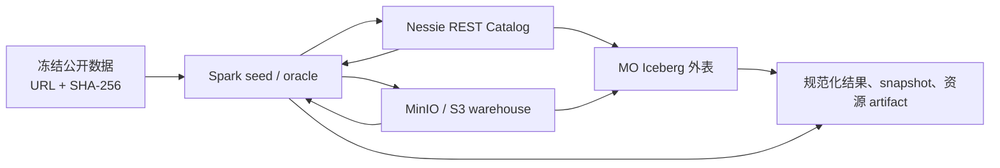

# Iceberg 外部表功能测试设计（Issue #23359）

## 1. 背景与目标

Issue [#23359](https://github.com/matrixorigin/matrixone/issues/23359) 为 MatrixOne（MO）新增通过 Iceberg REST Catalog 查询和写入外部 Apache Iceberg 表的能力。本设计以研发评论附带的《MatrixOne Iceberg 用户指南》和《MatrixOne Iceberg 公开数据集测试指南》为验收契约，覆盖已合入 `main` 的实现，不将 Iceberg 规范中尚未承诺的能力纳入通过标准。

测试的核心不是验证某条 SQL 返回成功，而是证明 MO 与 Spark 在**同一 catalog、warehouse、ref 和 snapshot**上观察到一致的数据和元数据；所有失败路径必须保持外表映射、远端 snapshot 和对象引用的原子性。

本文件是测试设计，不记录执行结论。实际测试记录必须填写真实的 `main` 40 位 commit、环境、数据哈希、snapshot、日志或 CI artifact 后，才能给出通过/不通过结论。

### 1.1 已支持范围

| 范围 | 本轮正向验收 |
| --- | --- |
| Catalog | Iceberg REST / `native-rest`；Nessie 作为 REST Catalog 实现 |
| 格式和文件 | format v1/v2 读取；format v2 写入和行级 DML；Parquet data file |
| 读取类型 | boolean、int/long、float/double、decimal、date、timestamp/timestamptz、string、binary |
| 分区 | 读取和安全剪枝：identity、year/month/day/hour、bucket、truncate；写入：identity、时间/日期 year/month/day、时间 hour |
| 读取语义 | append-only、position/equality delete 的 merge-on-read、snapshot/timestamp/ref time travel |
| 写入与维护 | INSERT、INSERT OVERWRITE、DELETE、UPDATE、MERGE、rewrite data files/manifests、expire snapshots |
| 协作 | Nessie branch/tag/hash/snapshot 读取；branch 写入；与 Spark（可选 Trino）交叉验证 |

### 1.2 明确不作为正向能力验收

以下项目必须以稳定的 `unsupported` 类错误拒绝，且不得 panic、hang、OOM、静默丢数据或泄漏敏感信息：Iceberg v3/v4、Avro/ORC data file、`time`/`uuid`/`fixed`/`struct`/`list`/`map`/geometry 等嵌套或未支持类型、deletion vector、bucket/truncate 分区写入、自动 orphan GC、delete spill、`enable-per-account=true`、tag/hash/snapshot 的普通写入。

## 2. 测试策略

### 2.1 通过判定与 Oracle

1. Spark Iceberg 客户端是主 oracle；可用时增加 Trino 作为第三 oracle。
2. 对账前先确认 `catalog URI + warehouse + namespace.table + ref + snapshot ID` 完全一致；不同 snapshot 的结果不得直接比较。
3. 有序结果必须提供完整稳定的 `ORDER BY`；decimal 统一 CAST，浮点统一 ROUND/容差，timestamp 固定会话时区，NULL/NaN/正负零的输出规则写入 case metadata。
4. 成功写入必须验证：一次 Catalog commit、MO/Spark 可见性、data/delete/manifest 变化、无部分发布；失败写入必须复查 snapshot、行集和 orphan/作业记录。
5. 常规功能用例至少连续执行 3 次；并发、超时、cache 和资源场景执行 10–20 次，并在适用的 Go 生命周期路径执行 `-race`。

### 2.2 分层与数据

| 层级 | 数据/拓扑 | 目的 | 频率 |
| --- | --- | --- | --- |
| T0 本地确定性 | 小型自建 v1/v2 表，Nessie + MinIO + MO + Spark | DDL、类型、错误契约、写入/DML 原子性 | 每个 Iceberg PR |
| T1 公开数据 smoke | NYC TLC Yellow Taxi 2024-01，固定 200,000 行 | 真正 Iceberg 表的 mapping 与四类基础对账 | 每日/PR advisory |
| T2 nightly | NYC TLC 2024-01 全月 + 可写副本 | 完整读取、time travel、schema/delete/ref 和跨引擎写入 | nightly required |
| T3 周期扩展 | NOAA 固定年份、ClickBench 单/100 文件、small-files 表 | 多分区、性能、规划与维护 | weekly / release |
| T4 负向兼容 | Overture Maps 固定 release 小切片或等价自建 nested table | 不支持类型/格式的 fail-fast 与脱敏 | 版本升级 / release |

每次公开数据运行必须生成 dataset manifest：固定 URL、下载 UTC 时间、文件大小、SHA-256、源 schema、许可证/署名、seed SQL 哈希、Spark/Iceberg/JDK 版本、format version、partition spec、table UUID、ref、snapshot 和各类文件计数。URL 相同但 SHA-256 变化即视为新数据版本。

### 2.3 推荐拓扑与前置条件



- 本地联调允许 `MO_ICEBERG_ALLOW_PLAIN_HTTP=1`；生产/发布验收必须使用 HTTPS。
- CN 至少开启 `[cn.frontend.iceberg] enable=true`。写入、DML、维护场景仅打开相应的 `enable-write`、`enable-delete`、`enable-dml`、`enable-maintenance` 开关；`enable-delete-spill`、`enable-orphan-gc`、`enable-per-account` 保持关闭。
- 创建 Catalog 后，按最小权限为测试身份建立 `iceberg_register_access` principal mapping 与 residency policy；禁止把 access key、secret、bearer token、签名 URL 或原始敏感路径写入 SQL、日志和 artifact。
- 读基线外表使用 `read_mode=merge_on_read`，以覆盖 delete file；对照只读权限使用 `write_mode=read_only`。可写测试必须使用独立的 format v2 副本和 run-id 命名的 namespace/ref，避免污染冻结基线或并行任务。

## 3. 功能测试用例

### 3.1 配置、Catalog 与访问控制

| ID | P | 场景与操作 | 预期与断言 |
| --- | --- | --- | --- |
| ICE-CAT-001 | P0 | 仅开启 `enable`，创建 REST Catalog、access/residency、外表 mapping，执行 `SHOW ICEBERG ...` 与基础查询 | Catalog、mapping 和系统表可见；敏感值不回显；MO/Spark 同 snapshot 的 COUNT 一致 |
| ICE-CAT-002 | P0 | 分别关闭 `enable`、使用 HTTP（未设置开发开关）、不支持的 catalog type、空/重复 mapping option | stable `ICEBERG_FEATURE_DISABLED` / config/validation 错误；无网络副作用或本地脏记录 |
| ICE-CAT-003 | P0 | 缺失 principal mapping、错误 endpoint/region/bucket、失效/缺失 credential、虚报 remote-signing capability | 分别返回 principal/residency/credential/signing 类错误；不可通过放宽 scope 掩盖；无 token/签名 URL 泄漏 |
| ICE-CAT-004 | P1 | ALTER Catalog 后查询；存在 mapping、policy、ref cache、job、orphan 依赖时 DROP Catalog | ALTER version 递增且新配置生效；DROP 被拒绝并列出依赖；先按生命周期清理后才允许删除 |
| ICE-CAT-005 | P1 | 多账户/角色/用户使用相同 Catalog，但只给一个主体授权 | 授权主体可访问，其他主体 fail closed；不得跨账户/角色读取同一外部数据 |

### 3.2 Mapping、类型与基础读取

| ID | P | 场景与操作 | 预期与断言 |
| --- | --- | --- | --- |
| ICE-READ-001 | P0 | v1/v2 Parquet 表映射全量 primitive schema，MO 与 Spark 执行 COUNT、定时范围 COUNT/SUM、稳定排序投影、GROUP BY | 行数、逐行投影、NULL、decimal、timestamp、聚合 key/count/sum/avg 一致 |
| ICE-READ-002 | P0 | v2 表中包含 position delete 与 equality delete；分别以 `append_only`、`merge_on_read` 映射查询 | append-only 明确拒绝 delete manifest；merge-on-read 行集与 Spark 一致，已删除行绝不返回 |
| ICE-READ-003 | P1 | boolean/int/long/float/double/decimal(含 precision 1、18、38)/date/timestamp/timestamptz/string/binary 的 NULL、边界与典型值 | MO 类型和值符合映射；浮点按约定容差，decimal scale、微秒精度及 session timezone 无偏移 |
| ICE-READ-004 | P1 | 本地列漏列、多列、错误类型、大小写可匹配与大小写歧义；远端 rename 后保留 field ID | 不存在/歧义列拒绝；正确 mapping 使用 field ID 而非 Parquet 列序；不能按旧列名错配 |
| ICE-READ-005 | P1 | 映射上执行 SELECT、DROP TABLE；尝试 TRUNCATE、CREATE TABLE LIKE、CREATE INDEX 和远端表删除 | SELECT/本地 DROP 行为正确，远端数据及 snapshot 不变；未支持语句稳定拒绝 |

### 3.3 规划、剪枝与时间旅行

| ID | P | 场景与操作 | 预期与断言 |
| --- | --- | --- | --- |
| ICE-PLAN-001 | P0 | identity/year/month/day/hour/bucket/truncate 分区表，针对等值、范围、IN、无关谓词执行查询 | 结果与 Spark 一致；保守多读可接受，任何漏行即失败；保存 EXPLAIN、task/data-file/manifest 数 |
| ICE-PLAN-002 | P1 | 有 data-file lower/upper bound、NULL/NaN count、row-group 的表执行 projection/filter | 结果正确；计划可做安全 prune，residual predicate 仍执行；不得因统计不完整漏读 |
| ICE-PLAN-003 | P0 | Spark append 后记录 snapshot；MO 使用 `FOR ICEBERG SNAPSHOT`、`TIMESTAMP AS OF` | 当前 snapshot 看到新行，旧 snapshot 的 count/checksum 不变；timestamp 选择该时间点前最新 snapshot |
| ICE-PLAN-004 | P1 | timestamp 早于 epoch、此前无 snapshot、无效/不存在 snapshot/ref、Iceberg time travel 与 MO native snapshot hint 并用 | 明确拒绝，且不影响当前 mapping/cache |
| ICE-PLAN-005 | P1 | 冷 cache 与热 cache 重复查询；设置合理短 TTL 后由 Spark 提交新 snapshot | 同一 snapshot 的结果一致；revalidation 后看到外部提交；不允许 cache 永久陈旧 |

### 3.4 Schema/partition evolution 与跨引擎可见性

| ID | P | 场景与操作 | 预期与断言 |
| --- | --- | --- | --- |
| ICE-EVO-001 | P0 | Spark add nullable column；对演进前、后 snapshot 各做 count/checksum/样本投影 | 新列在旧行显示 NULL；前后 snapshot 各自结果正确 |
| ICE-EVO-002 | P1 | Spark rename column（field ID 不变）、drop 列后同名新增列 | rename 后读取原 field 数据；同名新列不得复活旧 field 数据 |
| ICE-EVO-003 | P1 | partition spec 从 month 演进到 day，追加新数据并按月/日过滤 | 新旧 spec 同时正确读取、没有丢行；剪枝仅作为附加证据 |
| ICE-EVO-004 | P0 | Spark 进行 append/delete/update/merge 后，MO 读取；MO 进行写入/DML 后，Spark（可选 Trino）读取 | 参与引擎在同一 snapshot 的规范化结果一致，metadata/file 增减可追溯 |

### 3.5 INSERT、OVERWRITE 与行级 DML

| ID | P | 场景与操作 | 预期与断言 |
| --- | --- | --- | --- |
| ICE-DML-001 | P0 | 在 format v2、Parquet、支持类型和分区 transform 的表上用 MO 执行多行 VALUES、INSERT SELECT append | 每 statement 恰好一次 commit；Spark 可见新行；cache 失效；prepared INSERT 重复执行产生独立 commit identity |
| ICE-DML-002 | P0 | 缺 `enable-write`、`write_mode=read_only`、v1、非 Parquet、必填字段缺失、writer 不支持类型/transform | 写入前 fail fast；snapshot、data/delete/manifest 引用与行集不变 |
| ICE-DML-003 | P1 | 全表 `INSERT OVERWRITE`；静态完整 partition tuple overwrite；空/重复/动态/不完整 partition tuple | 目标 scope 正确替换、非目标 partition 不变；非法语法或 delete-task 风险明确拒绝且原子 |
| ICE-DML-004 | P1 | DELETE、UPDATE、MERGE 的 matched update/delete、not matched insert、无命中、NULL/多列赋值；Spark 交叉对账 | 结果及 delete/replacement file 正确；限制语法（UPDATE FROM、重复 assignment、无 ON/action 等）稳定拒绝 |
| ICE-DML-005 | P0 | 两个 writer 同时推进同一 branch；客户端在 commit 响应前断连 | 一个提交成功或按 Catalog 返回 `ICEBERG_COMMIT_CONFLICT`，绝无部分发布；commit unknown 先按 snapshot summary/idempotency key/job 核验，禁止盲目重放 |

### 3.6 Nessie ref 与 cache 隔离

| ID | P | 场景与操作 | 预期与断言 |
| --- | --- | --- | --- |
| ICE-REF-001 | P0 | `main` 创建 `branch:<run-id>`，在 branch append；交替查询 main、branch、tag | branch 只显示自身新增行，main 不显示；各 ref 返回各自 snapshot |
| ICE-REF-002 | P1 | 相同身份/credential 高频交替查询两个 ref；Spark 在其中一个 ref 提交 | metadata/manifest cache key 不串 ref；MO revalidation 后仅更新发生提交的 ref |
| ICE-REF-003 | P1 | 向 tag/hash/snapshot 发起 INSERT/DELETE/UPDATE/MERGE；向 branch 写入 | tag/hash/snapshot 在写对象前拒绝；branch 允许 optimistic commit；仅 capability + `allow_tag_move` 的维护路径可另测 tag 移动 |

### 3.7 维护、恢复与资源保护

| ID | P | 场景与操作 | 预期与断言 |
| --- | --- | --- | --- |
| ICE-MNT-001 | P1 | 产生多个小 data file 后调用 `iceberg_rewrite_data_files` | count/checksum 不变，候选文件数下降；新 snapshot、commit、job 状态和 rewritten/removed count 可追溯 |
| ICE-MNT-002 | P1 | 调用 `iceberg_rewrite_manifests` | 逻辑结果不变；新 metadata/manifest commit 可追溯 |
| ICE-MNT-003 | P1 | 创建受保护 tag/ref 后 `iceberg_expire_snapshots` | 被保护 snapshot 保留；过期 snapshot 不可 time travel；候选对象只登记 orphan，不自动物理删除 |
| ICE-MNT-004 | P1 | commit 前/后注入 Catalog/Object I/O 失败、维护 conflict/unknown、重复 job_id | 无半提交；unknown 可核验；orphan 与 maintenance job 有可审计状态；幂等 key 不重复执行 |
| ICE-RSC-001 | P1 | N-1/N/N+1 边界覆盖 manifest cache、max-manifest-files、max-data-files、planning memory/timeout | N-1 成功、N+1 fail fast；不 OOM、不无限重试；cache process-wide 上限、TTL/eviction 有证据 |
| ICE-RSC-002 | P1 | 大 delete/DML 状态、未知长度 signed HTTP、并发查询、取消查询 | delete/dml memory 超限稳定失败；无 OOM/hang；取消后 goroutine、reader、ObjectIO 引用和临时对象回落 |

### 3.8 不支持能力与安全回归

| ID | P | 场景与操作 | 预期与断言 |
| --- | --- | --- | --- |
| ICE-NEG-001 | P0 | v3、deletion vector、Avro/ORC data file、加密文件 | 分类明确的 unsupported 错误；不将空结果误报为成功 |
| ICE-NEG-002 | P0 | `time`、`uuid`、`fixed`、struct/list/map、geometry/variant；GeoParquet binary 按 binary 投影 | 未支持类型 fail-fast；binary 投影仅验证字节读取，不宣称地理语义；无 panic/NULL 静默降级 |
| ICE-NEG-003 | P1 | bucket/truncate 分区写入、binary/嵌套写入、`enable-delete-spill=true`、`enable-orphan-gc=true`、`enable-per-account=true` | 与当前契约一致地拒绝/failed closed；读能力不可被误判为写能力 |
| ICE-NEG-004 | P0 | 对所有错误路径检查 SQL/client 日志、系统表、artifact | 不出现 bearer token、access/secret/session key、signed URL query、密码或未脱敏客户路径 |

## 4. 性能与稳定性设计

### 4.1 表布局与工作负载

| 表 | 布局 | 验证目标 |
| --- | --- | --- |
| `tlc_one_month` | NYC TLC 2024-01，合理文件大小 | nightly 稳定正确性/性能基线 |
| `tlc_twelve_months` | 12 个月、month partition | 多分区与时间范围 prune |
| `hits_single` | ClickBench 单大文件写入 Iceberg | 大 row-group、顺序扫描和聚合 |
| `hits_100` | ClickBench 100 文件版本 | planning 并行度、manifest/data-file 压力 |
| `small_files` | 多次小 append 的数百/数千文件 | 限流、rewrite 与 cleanup |

每条性能 SQL 预热一次后执行 5 次，报告 min/median/max；冷 cache 与热 cache 分开记录。采集 planning/first-row/total latency、rows/s、logical bytes/s、manifest/data/delete/scan-task/row-group 数、cache hit/miss/bytes/eviction、CN RSS/Go heap/GC、Catalog/ObjectIO 请求/字节/重试/超时，以及规范化 result checksum。

同硬件、同 MO commit、同配置、同数据 SHA-256、同 snapshot 下：median 慢于基线超过 20% 且绝对增加超过 1 秒标记待分析；慢于 35%、OOM、timeout、结果差异或资源上限失效为失败。首次基线或环境/数据/snapshot/引擎变化只记录，不做相对门禁。

## 5. 自动化与回归落点

| 内容 | 回归建议 | 说明 |
| --- | --- | --- |
| 快速确定性 SQL、DDL、错误契约 | MatrixOne BVT 或匹配 motr suite | 每个 test/result 写 issue 和 target branch 注释 |
| Iceberg 跨功能 SQL | `motr/suites/14_issue_regression` 或 Iceberg domain suite | 保持稳定排序和脱敏 result |
| 多连接、Spark/Nessie/MinIO、并发、协议和 artifact 对账 | `motr/suites/scenarios/<suite>` | runner 管理 run-id、ref、规范化输出和清理 |
| Catalog adapter、commit unknown、cache/ref ownership、fault injection | Go UT + focused `-race` | 只放无法由公共 SQL 触发的内部路径 |
| ClickBench/NOAA、阈值、manifest-heavy 与内存 | nightly big-data | 记录数据规模、拓扑、峰值资源与 timeout |
| CN kill、网络分区、credential/signer 短暂故障 | stability/chaos | 明确注入点、恢复期限、数据不变量和清理 |

建议复用研发文档给出的 `dev-up-iceberg-tier-a`、`dev-seed-iceberg-tier-b-nyc-tlc`、`test-iceberg-preflight`、`test-iceberg-nightly` 作为 Tier B 起点。每个 run 至少保存 `dataset-manifest.json`、脱敏配置与环境、版本、catalog/ref/snapshot 摘要、查询 SQL、`mo.out`、`spark.out`、diff、资源指标、secret/path scan 和 run summary；不得提交原始公开数据或敏感凭据。

## 6. 准入、退出与报告

### 6.1 执行准入

- 记录 official `main` 的 40 位 SHA、MO/CN 配置、部署拓扑、Spark/Iceberg/Nessie/Trino/JDK 版本和测试日期。
- preflight 确认 REST Catalog、warehouse、principal mapping、residency、credential/remote signing、format/version/partition spec 可用。
- dataset manifest 的 SHA-256、seed SQL 哈希和 snapshot 已冻结；使用独立 run-id 的 namespace/ref 和可清理的对象前缀。
- P0 用例先在黑盒 SQL/协议路径执行；白盒 fault injection 仅补足无法由公共接口触达的错误分支。

### 6.2 发布退出条件

1. P0 全部通过；完整 NYC 月度数据的 MO/Spark 同 snapshot 对账无差异。
2. snapshot/time travel、schema evolution、position/equality delete 各至少存在一条真实文件证据。
3. MO 写入后 Spark 可见，Spark 写入后 MO 可见；branch/tag/ref cache 不串读。
4. maintenance 前后逻辑 checksum 不变；失败与 unknown commit 不造成半提交或重复非幂等写入。
5. 所有 expected error 分类正确，且未见 panic、hang、OOM、goroutine/ObjectIO 泄漏或敏感信息泄漏。
6. artifact 完整、secret scan 通过；性能未跨越本设计的发布阈值。

若环境、数据源或基础设施阻断执行，不发布“测试通过/不通过”结论，而是在报告中明确 blocker 和未执行用例。

### 6.3 测试报告最小模板

```markdown
### 测试版本
- 分支/commit：`main` / `<40 位 SHA>`
- 拓扑与配置：<MO、Nessie、MinIO/S3、feature gates>
- 数据集：<dataset_id、SHA-256、ref、snapshot>

### 原问题验证
<原始功能路径、MO 与 Spark 规范化对账结果>

### Happy Path 覆盖
1. <真实执行用例与证据>

### Unhappy Path 覆盖
1. <错误类别、操作后 snapshot/行集/对象状态>

### 白盒验证
<Go UT/-race，或不适用及理由>

### 回归测试
<BVT/motr/UT/big-data/chaos 文件、PR、CI>

### 测试证据
<CI、artifact、日志、截图；均已脱敏>

### 测试结论
测试通过。/测试不通过。
```

## 7. 需求追溯

| 研发文档能力 | 本设计覆盖 |
| --- | --- |
| REST Catalog、安全授权与驻留 | ICE-CAT-001 ~ 005、ICE-NEG-004 |
| 外表 mapping、read/write mode、field ID | ICE-READ-001 ~ 005、ICE-DML-001 ~ 004 |
| v2 delete、DML 与 optimistic commit | ICE-READ-002、ICE-DML-004 ~ 005、ICE-MNT-004 |
| 剪枝、time travel、schema/partition evolution | ICE-PLAN-001 ~ 005、ICE-EVO-001 ~ 003 |
| Nessie branch/tag 与缓存隔离 | ICE-REF-001 ~ 003 |
| maintenance、orphan 和资源上限 | ICE-MNT-001 ~ 004、ICE-RSC-001 ~ 002 |
| 公开数据、跨引擎 oracle 与性能分层 | 第 2 章、第 4 章、ICE-EVO-004 |
| 不支持范围和 fail-closed | ICE-NEG-001 ~ 004 |

## 8. 参考资料

- Issue：[matrixorigin/matrixone#23359](https://github.com/matrixorigin/matrixone/issues/23359)
- 研发评论附件：[MatrixOne Iceberg 用户指南](https://github.com/user-attachments/files/30295086/matrixone_iceberg_user_guide.md)
- 研发评论附件：[MatrixOne Iceberg 公开数据集测试指南](https://github.com/user-attachments/files/30295087/matrixone_iceberg_public_dataset_test_guide.md)
