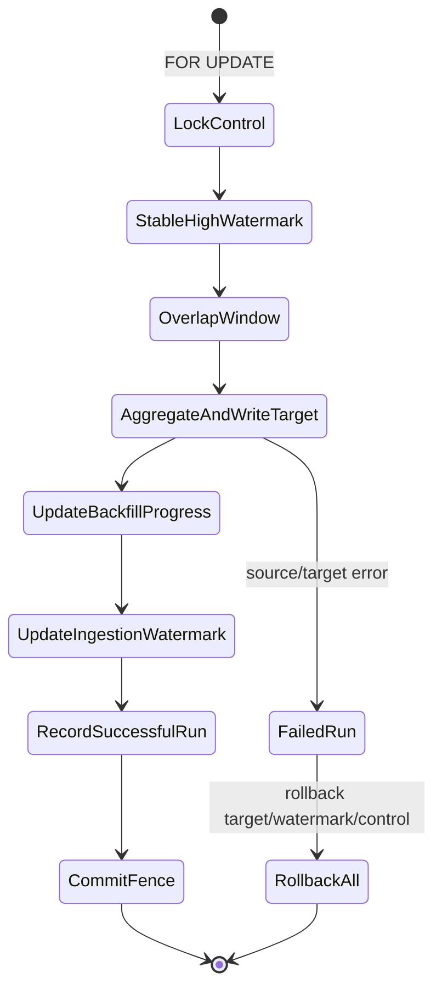

# MatrixOne MongoDB External Table 详细测试设计

## Feature 背景与范围

本 Feature 为 MatrixOne 增加 MongoDB 原生外部表读取能力。用户先创建 MongoDB connection，再以显式 MatrixOne schema 创建 `ENGINE=MONGODB` external table；执行链路为 `MongoDB find/getMore → CN MongoScan → MatrixOne batch/vector → Filter/Join/Aggregate/Window/Insert/Replace`。

本设计以 Issue [#26229](https://github.com/matrixorigin/matrixone/issues/26229)、研发文档 [matrixone_mongodb_external_table_user_guide.md](https://github.com/user-attachments/files/30577010/matrixone_mongodb_external_table_user_guide.md)、实现 PR [#26424](https://github.com/matrixorigin/matrixone/pull/26424)、修复 PR [#26495](https://github.com/matrixorigin/matrixone/pull/26495) 和 review comment [#5314509639](https://github.com/matrixorigin/matrixone/issues/26229#issuecomment-5314509639) 为输入，同时以当前 MatrixOne main 的实现、正式文档和现有测试资产校正支持边界。

测试范围不是单独验证一张 MongoDB 外表能否 `SELECT`，而是验证它作为 MatrixOne 只读数据源，与 MatrixOne 正式支持的表对象、列属性、目标表约束、数据类型、查询算子、事务、权限和恢复能力组合后，结果仍然正确且失败原子。测试结果拆成三个独立判定套件：MongoDB Connector Contract、MatrixOne Integration、NESR Cutover Gate；前两者通过不能替代真实 NESR 上线门禁。

覆盖对象包括：

- MongoDB connection 的创建、展示、修改、启停、删除、版本更新、secret reference、网络与拓扑策略；
- MongoDB external table 显式 schema、column path、`MONGODB_CONVERT`、NULL/NOT NULL、DDL 生命周期；
- 当前实现允许映射的全部 MatrixOne 类型及当前 MatrixOne 支持、但 Mongo converter 不允许映射的类型；
- MongoDB 外表与普通永久表、临时表、集群表、视图、其他只读外表之间的读取、Join、Union 和写入交互；
- 普通目标表上的 NOT NULL、DEFAULT、PK、UNIQUE、FK、CHECK、AUTO_INCREMENT、生成列、二级索引和 CLUSTER BY；
- projection/predicate pushdown 和 residual filter、CTE/subquery、Join、Group、Window、TimeWindow、`max_by`、`GAPFILL`；
- `CREATE TABLE AS SELECT`、`INSERT ... SELECT`、`REPLACE ... SELECT` 和 bounded incremental ingest；
- strict/try_null、缺失字段、BSON null/undefined、类型错误、溢出、错误预算、事务回滚；
- 并发、取消、CN/网络故障、连接版本切换、Snapshot/PITR、资源上限和 big-data。

MVP 执行约束为单 CN、`max_parallelism=1`。MongoDB source 只读，外表本身不保存 watermark/checkpoint/CDC 状态。

## 支持证据与版本基线

- MatrixOne main SHA：`ccb37f591b07e9901da2e0e7b5cb1733485e8771`。
- 核验日期：2026-08-18。
- Feature 证据：Issue #26229、PR #26424、研发用户指南和 `pkg/sql/mongodb/`、`pkg/sql/colexec/mongoscan/`、`pkg/sql/plan/`、`test/mongodb/`。
- MatrixOne 表对象证据：[CREATE TABLE](https://docs.matrixorigin.cn/en/dev/MatrixOne/Reference/SQL-Reference/Data-Definition-Language/create-table/)、[CREATE TEMPORARY TABLE](https://docs.matrixorigin.cn/en/v26.3.0.12/MatrixOne/Develop/schema-design/create-temporary-table/)、[CREATE CLUSTER TABLE](https://docs.matrixorigin.cn/en/v26.3.0.12/MatrixOne/Reference/SQL-Reference/Data-Definition-Language/create-cluster-table/)、[CREATE EXTERNAL TABLE](https://docs.matrixorigin.cn/en/v26.3.0.12/MatrixOne/Reference/SQL-Reference/Data-Definition-Language/create-external-table/)、[CREATE VIEW](https://docs.matrixorigin.cn/en/v26.3.0.12/MatrixOne/Reference/SQL-Reference/Data-Definition-Language/create-view/)。
- Schema/constraint 证据：现有 `test/distributed/cases/ddl/`、`table/`、`foreign_key/`、`auto_increment/`、`temporary/`、`view/` 和 [Primary Key](https://docs.matrixorigin.cn/en/v26.3.0.12/MatrixOne/Develop/schema-design/data-integrity/primary-key-constraints/)、[foreign_key_checks](https://docs.matrixorigin.cn/en/v26.3.0.12/MatrixOne/Reference/Variable/system-variables/foreign_key_checks/)。
- 类型证据：当前 `pkg/container/types/types.go`、`pkg/sql/mongodb/converter.go::supportedMOType` 和 [Data Types](https://docs.matrixorigin.cn/en/m1intelligence/MatrixOne-Intelligence/Reference/Data-Types/data-types/)。
- 当前 Mongo converter 明确允许：BOOL；有符号/无符号整数；FLOAT/DOUBLE；DECIMAL64/128/256；DATE/DATETIME/TIMESTAMP；CHAR/VARCHAR/TEXT；BINARY/VARBINARY/BLOB；JSON。
- 当前 external table builder 明确拒绝 inline PK/KEY/UNIQUE/INDEX/FULLTEXT 和 CHECK；MongoDB external table 明确拒绝 `ALTER TABLE` 修改 schema。
- 当前 main 的 `test/mongodb/README.md` 表明 SQL surface 默认开启，但没有 allowlist 时仍不能访问网络。这与较早研发文档的“默认关闭”冲突，因此设计同时覆盖省略 enable 配置和显式关闭，并把 release 口径列为待确认项。
- Feature 尚未进入稳定 release 兼容矩阵；MongoDB 8.0.12 和 Go Driver v2.8.0 是当前 PR E2E 基线，不代表唯一兼容版本。
- MatrixOne Feature List 标记为 Experimental 的 Dynamic Table、Stream、Partition 等不作为正式准入合同；仅做 fail-closed 或条件性探索，不用实验能力的行为判定本 Feature 失败。

## 验收目标与非目标

验收目标：

1. 所有受支持 BSON→MO 类型映射在正常值、上下界、NULL、缺失、错误类型和溢出条件下均符合显式 schema 和转换模式。
2. MongoDB 外表源列的 NULL/NOT NULL 和路径语义在 catalog、plan、runtime converter 全链路一致；源表不应意外获得本地存储表约束语义。
3. MongoDB 外表可被 MatrixOne 正式支持的表对象安全消费：普通表/临时表/集群表可作为 Join 或写入目标，视图可封装查询，其他外表可做只读 Join/Union。
4. MongoDB 外表写入带全部正式支持约束的普通目标表时，成功路径满足约束，失败路径不留下部分 target、错误 auto_increment 状态或前移的 watermark。
5. projection/predicate 下推只能减少远端返回数据，不得改变 MatrixOne residual 语义；所有结果与禁用下推的独立 Oracle 等价。
6. `INSERT/REPLACE ... SELECT`、CTAS、Join、Group、Window、TimeWindow、`max_by`、GAPFILL 使用普通 MatrixOne operator，并保持类型、NULL、key 和事务语义。
7. connection/table 的 tenant、权限、版本、启停、删除和 plan/client cache 生命周期正确；旧 plan/client 不得越过新状态。
8. NESR 四 collection、嵌套字段、UNION ALL、control/progress/watermark/run/fence 状态机、overlap 删除语义和客户峰值模型均有独立可执行的验收证据。
9. cancel、find/getMore 错误、target 写失败、CN 重启、secret rotation 和重放后，cursor、lease、semaphore、transaction、lock、vector 全部释放。
10. big-data 场景有明确规模、数据分布、测量项、资源阈值和通过标准，可直接转化为 nightly/stability 用例。

非目标及待确认项：

- 向 MongoDB 写入或对 MongoDB external table 直接执行 INSERT/UPDATE/DELETE/REPLACE；
- 自动 schema inference、Change Stream/CDC、MongoDB `$group` pushdown；
- 数组元素路径、自动展开数组/文档；prepared MongoDB scan/`COM_STMT_*` 未被 Issue 或研发文档声明为限制，当前实现拒绝，作为兼容性待确认项（#27411）；
- local split、多 CN fanout 或 `max_parallelism>1`；
- 用实验中的 Dynamic Table/Stream/Partition 行为为正式准入背书；
- 未声明为兼容版本的 MongoDB server/driver/client 全排列。

## 涉及的 MatrixOne 能力

- capability_id: `dataio.stage-and-external-data`：MongoDB 外部数据读取、外部错误、限流和资源释放；主能力。
- capability_id: `schema.ddl-lifecycle`：connection/external table、表类型、列属性、依赖关系、DROP/重建和禁止 ALTER；必需交互。
- capability_id: `sql.data-types-and-conversion`：全部 BSON→MO 类型、精度、scale、宽度、NULL 和转换模式；必需交互。
- capability_id: `query.optimizer-and-plan`：projection/predicate pushdown、residual、Join、聚合、窗口和 CTAS/DML source plan；必需交互。
- capability_id: `transaction.statement-atomicity`：单条 INSERT/REPLACE/CTAS 的成功或完整回滚；必需交互。
- capability_id: `transaction.explicit-transaction`：target 与 watermark 同事务、commit/rollback 和并发 fence；高风险交互。
- capability_id: `security.authorization-and-isolation`：admin DDL、普通用户 SELECT、view security、cluster table 和 tenant 隔离；必需交互。
- capability_id: `session.connection-lifecycle`：取消、断连、stale mapping、client lease 和 generation retirement；高风险交互。
- capability_id: `storage.data-durability`：提交后 target/control row 在 CN/TN 重启后保持一致；必需交互。
- capability_id: `recovery.snapshot`、`recovery.pitr`：恢复 external mapping、依赖对象和 target/control 数据，不产生 orphan mapping；条件适用。
- capability_id: `observability.explain-and-diagnostics`：EXPLAIN、指标、日志、错误分类与脱敏；常见交互。
- capability_id: `ecosystem.mysql-clients-and-drivers`：通过 MatrixOne MySQL 协议入口执行，而不是把 CN 内 Mongo driver 当作客户端兼容承诺；条件适用。

## 架构、入口、数据流与状态对象

入口包括 `CREATE/ALTER/DROP MONGODB CONNECTION`、`SHOW MONGODB CONNECTIONS`、`CREATE EXTERNAL TABLE ... ENGINE=MONGODB`、`SHOW CREATE TABLE`、SELECT/CTE/JOIN/VIEW/CTAS 和 `INSERT/REPLACE ... SELECT`。

数据流：parser 将 connection 和 table mapping 写入 catalog；planner 绑定 mapping ID/version，产生 MongoScan 和 residual plan；CN 执行前重新校验 catalog、resolve secret，使用 Go Driver 发起 `find/getMore`；converter 按列 path/type/nullability/mode 构造 MO vectors；后续算子与本地表一致。

必须观察的状态对象：

- catalog：account/tenant、connection ID/version/status、table/database ID、engine discriminator、schema/path/mode/nullability；
- plan/cache：mapping version、projection、candidate predicate、residual predicate、prepared 标志；
- MongoDB：database/collection、document、cursor、server role、read preference/read concern、TLS/SRV/ReplicaSet；
- CN runtime：client cache/generation/lease、pool checkout、source semaphore、context、batch/vector/mpool；
- MatrixOne storage：target rows、PK/UNIQUE/FK/CHECK/AUTO_INCREMENT 状态、control row、watermark、lock、transaction；
- observability：scan rows/bytes、decoded bytes、conversion attempts/errors、find/getMore/cancel phase、selected member、cleanup。

同步完成以 SQL 成功/失败和事务状态为准；异步 client retirement、cursor close、failover 和 secret rotation 使用 version、lease=0、cursor=0、指标稳定作为完成信号，不以固定 sleep 作为断言。

## 风险与关键不变量

| 风险 | 关键不变量 | 优先级 | 测试结果 |
|---|---|---|---|
| 类型错误 | 每个 BSON value 只能按公开映射转换；不能隐式放宽 String→Number、String→Date 等 | P0 | ◐ 代表性转换已测，完整类型参数化未完成 |
| NULL/约束 | missing/null/undefined/type-error 与 NULL、NOT NULL、try_null 的组合结果确定 | P0 | ✅ 核心 NULL/NOT NULL/target 约束已通过 |
| 目标约束 | PK/UNIQUE/FK/CHECK/NOT NULL 失败时整条 source DML 回滚 | P0 | ✅ |
| 时间下推 | BSON 毫秒精度与 DATETIME/TIMESTAMP(0..6) 比较不得产生 false negative | P0 | ◐ scale 0 低精度 equality/range/IN 与本地 Oracle 已通过；pushed candidate 仍未覆盖 |
| 表类型 | 不同对象的可读、可写、会话、租户和 owner 语义不串线 | P0 | ◐ Mongo/普通表核心已测，temp/cluster/tenant 未完成 |
| 安全 | secret/URI/endpoint/query literal 不进入 SHOW、plan、日志、错误和 artifact | P0 | ◐ EXPLAIN/权限 marker 已测，全链路脱敏未完成 |
| catalog 分类 | generic external metadata 不能伪装成 Mongo mapping 或借用高权限 connection | P0 | ✅ |
| 事务 | source scan、target mutation、constraint side effect 和 watermark 同成同败 | P0 | ◐ statement 原子性已测，watermark 未完成 |
| 资源 | raw/decoded/vector 均受预算约束；超限 fail-fast，不 OOM/restart | P0 | ◐ `max-value-bytes` 与宽度边界已测；decoded/vector、scan bytes/rows 和 conversion budget 未完成 |
| 推下正确性 | pushed filter 是候选过滤，最终结果始终由 MO residual 语义保证 | P1 | ◐ EXPLAIN/代表性 predicate 已测 |
| 确定性 | 相同时间使用稳定 tie key；聚合 partial merge 不依赖 batch 到达顺序 | P1 | ✅ max_by/GAPFILL 代表性结果已通过 |
| 生命周期 | ALTER/DISABLE/DROP/rotation 后新语句不能使用 stale mapping/client | P1 | ◐ create/SHOW/DROP、ALTER SET、disable/enable 已测；stale plan 和真实 secret rotation 未完成 |
| 恢复 | 重启、Snapshot/PITR 后无 orphan mapping，已提交 target/control 一致 | P1 | ⏸️ |
| 大规模复杂度 | 高 cardinality、宽 schema、长 varlen、低选择率不能导致非预期平方复杂度 | P1 | ⏸️ |

## 测试环境、拓扑、配置与数据

### 环境矩阵

| 环境 | MatrixOne | MongoDB | 用途 | 测试结果 |
|---|---|---|---|---|
| E1 单机功能 | 当前 main，1 CN/1 TN | 8.0.12 单节点 ReplicaSet | BVT、类型、DDL、查询、DML | ⏸️ 本轮未使用 |
| E2 分布式 | 3 CN/多 TN，但 Mongo scan 固定单 CN | 3 member ReplicaSet | session、failover、stale client、恢复 | ◐ 3 CN、三节点 Mongo、CN Pod 删除和 Mongo PRIMARY Pod 删除已测；多 TN 未覆盖 |
| E3 TLS/SRV | 1–3 CN | TLS 私有 CA、SRV/TXT、hostname | 网络、安全、发现和 allowlist | ⏸️ 环境未提供 |
| E4 多租户 | system + tenant A/B | 独立 database/credential | tenant、view、cluster table、secret scope | ⏸️ 环境未提供 |
| E5 故障注入 | 可 kill CN/TN、代理断流 | 可断 find/getMore/primary | 原子性、取消、重试、恢复 | ◐ 当前 namespace 的 CN、DN Pod 和 Mongo PRIMARY Pod 删除已通过；网络和 getMore 断流未执行 |
| E6 big-data | Nightly 独占环境 | 有索引的千万级 collection | 容量、稳定性、资源、性能 | ⏸️ 环境未提供 |

配置覆盖：默认 enable、省略 allowlist、显式 enable/disable、account allowlist、host suffix/CIDR、loopback、timeout、batch rows/bytes、max value/scan/decoded bytes、conversion error count/rate、source concurrency。所有 secret 使用随机测试值和 reference，不写进 SQL fixture。

### Fixture 数据域

每条 document 固定包含 `_id`、`case_id`、`partition_key`、`event_ts`，并按场景增加：

- 标量：Boolean、Int32、Int64、Double、Decimal128、String、ObjectID、DateTime、Binary、Document、Array；
- 特殊 BSON：missing、null、undefined、MinKey、MaxKey、Regex、JavaScript、Timestamp；
- 路径：普通字段、`a.b.c`、中间节点 missing/null/scalar/array、同名大小写字段；
- 数值：每种整数 min/max/越界、负数、整数/非整数 Double、NaN/±Inf、decimal precision/scale 边界；
- 字符：空串、ASCII、中文、emoji、组合字符、NUL、长度 n-1/n/n+1；
- 时间：epoch 前后、毫秒 000/001/099/100/999、各 scale、MO domain 上下界和越界；
- 二进制：空、各 subtype、ObjectID 12 bytes、长度 n-1/n/n+1；
- 查询：高/低选择率、NULL-heavy、skew partition、重复时间、稳定 tie `_id`；
- 约束：重复 PK/UNIQUE、孤儿 FK、CHECK 临界、NOT NULL 缺失、auto_increment 显式/省略值；
- 资源：大 document、重复 path 映射到多列、宽 schema、长 varlen winner、高 cardinality group。

Oracle 使用 Go Driver 或 mongosh 导出的 canonical Extended JSON，加独立 reference converter 产生期望 TSV/JSONL；精确列逐值相等，FLOAT/DOUBLE 仅对明确算术结果使用预先声明 tolerance。所有 case 以唯一 database/collection/table/connection 命名，清理只作用于本 case。

## 功能测试矩阵

### 测试结果列说明

各测试表新增“测试结果”列：`✅` 表示本轮在指定 TKE 环境中已执行且通过；`❌` 表示已执行但未通过；`◐` 表示只完成部分组合，不能视为整项通过；`⏸️` 表示尚未执行或依赖当前未提供的环境。未标记为 `✅` 的项目不计入已完成覆盖。

### 1. 表对象和角色全集

状态含义：`P` 为 Mongo Feature 正向准入；`I` 为互操作覆盖；`N` 为必须拒绝；`C` 为仅在对应正式能力环境中执行；`E` 为实验能力，不进入准入。

| MO 表对象/构造方式 | Mongo source | Join/Union 对端 | 写入目标 | 设计结论 | 测试结果 |
|---|---|---|---|---|---|
| MongoDB external table | P | P（自连接/多 collection） | N | 只读；直接 DML 必须拒绝 | ◐ 核心 SELECT/Union/Join 已覆盖；正向多 collection Join 需重建 fixture 后复核；TRUNCATE 未按预期拒绝 |
| 普通永久表 | 不适用 | P | P | 覆盖全部目标约束和数据类型赋值 | ✅ 目标约束核心组合已通过 |
| TEMPORARY TABLE | 不适用 | P | P | 仅当前 session 可见；断连自动清理 | ✅ 当前 session 可见、另一 session 不可见、显式 DROP 后无 catalog 残留 |
| CLUSTER TABLE | 不适用 | C | C | system admin 创建；tenant 只读范围按正式合同验证 | ⏸️ |
| VIEW | 不适用 | P | 不作为基础写入目标 | DEFINER/INVOKER、嵌套 view、权限撤销 | ◐ 基础查询及 Mongo View 低权限读取/直读隔离已通过；嵌套、撤权和 INVOKER 未完成 |
| 普通 external table（INFILE/S3） | I | I | N | 只读 Join/Union；不要求跨源 pushdown | ⏸️ |
| Iceberg external table | I | I | N | 有 Iceberg 环境才执行只读 Join/Union | ⏸️ 环境未提供 |
| `CREATE TABLE AS SELECT` | 不适用 | 不适用 | P | 新建普通表并物化 Mongo 查询结果 | ✅ 成功与失败原子性已通过 |
| `CREATE TABLE LIKE` | 不适用 | 不适用 | I | 验证普通目标 schema 构造；不复制 Mongo runtime connection | ✅ 普通表 LIKE 成功，Mongo 外表 LIKE 按预期拒绝 |
| 分区表 | E | E | E | 当前正式矩阵不承诺；仅确认不会误当 Mongo mapping | ⏸️ |
| Dynamic Table/Stream/Source | E | E | E | 不进入本 Feature 准入，另立实验专项 | ⏸️ |

#### 表对象详细用例

| ID | 能力 ID | 不变量 | 前置状态 | 操作 | 预期结果 | 清理/状态断言 | 环境/层级 | 测试结果 |
|---|---|---|---|---|---|---|---|---|
| OBJ-001 | `dataio.stage-and-external-data` | Mongo 外表只读且结果稳定 | E1，合法 connection/mapping | 连续 3 次 SELECT 全列/部分列 | 与 Oracle 完全一致，Mongo source 不变 | cursor/lease=0；DROP mapping 不删 collection | BVT+E2E | ✅ |
| OBJ-002 | `query.optimizer-and-plan` | 两个 Mongo mapping 不串 collection | 同 connection 下 collection A/B | JOIN、UNION ALL、自连接别名 | 行数/key 与 Oracle 一致；各 scan 的 projection/filter 独立 | 两个 cursor 均释放 | BVT+E2E | ✅ 正确数据库 fixture 下两 mapping、UNION ALL 和正向 Join 连续 3 次结果一致 |
| OBJ-003 | `query.optimizer-and-plan` | 普通表与 Mongo 外表互操作 | 普通表维表和 target | 两种 join order、semi/anti/left join | 结果与本地快照对照一致 | 普通表不被 SELECT 修改 | BVT | ✅ |
| OBJ-004 | `schema.ddl-lifecycle` | 临时表 session 隔离 | session A/B | A 建 temp 并 `INSERT SELECT`；B 同名访问；A 断连 | A 可见、B 不可见/可建独立同名；断连后清理 | 无持久 temp catalog/data | BVT+MOTR | ✅ A 可见 2 行；B 返回 table does not exist；DROP 后 catalog 计数 0 |
| OBJ-005 | `security.authorization-and-isolation` | cluster table 租户可见性不越界 | E4，sys 创建 cluster target | sys 写入 Mongo 结果；tenant A/B 查询 | sys 可见全部；租户只见自己的可见行；tenant 不可直接写 | cluster row/account key 正确 | 多租户 MOTR | ⏸️ |
| OBJ-006 | `security.authorization-and-isolation` | view security 不泄露 connection | DEFINER view，低权用户 | SELECT、SHOW CREATE VIEW、直读 base external | View SELECT 成功；直读外表和 SHOW CREATE VIEW 被拒绝；不显示 secret/endpoint | DROP view 后 dependency 正常 | BVT+MOTR | ◐ View 授权与 Mongo 外表隔离已通过；INVOKER、撤权、嵌套和 DROP/recreate 未完成 |
| OBJ-007 | `query.optimizer-and-plan` | 其他 external source 只参与 MO 层组合 | file/S3 external + Mongo external | JOIN/UNION/CTE | 结果正确；无错误跨源 predicate pushdown | 两类 reader 都释放 | BVT/条件 E2E | ⏸️ 环境未提供 |
| OBJ-008 | `transaction.statement-atomicity` | CTAS 全成全败 | 空 schema；Mongo fixture 含合法/非法行 | CTAS 成功；strict 转换中途失败 | 成功表 schema/rows 正确；失败不留半表/部分行 | catalog 与 storage 无残留 | BVT+MOTR | ✅ |
| OBJ-009 | `schema.ddl-lifecycle` | LIKE 不复制 Mongo 私有映射 | Mongo 外表和普通模板表 | `CREATE TABLE LIKE` 两种来源 | 仅正式允许的路径成功；不得生成可绕过 connection 的 Mongo mapping | SHOW CREATE 无 secret/marker 注入 | BVT | ✅ |
| OBJ-010 | `schema.ddl-lifecycle` | 实验对象不污染正式合同 | 默认关闭实验能力 | 尝试 partition/dynamic/stream 与 Mongo 组合 | 稳定拒绝或标记实验；不创建半对象 | catalog 无残留 | Parser/plan UT+BVT | ⏸️ |

### 2. Mongo external source 列属性和约束

Mongo 外表是远端只读映射，不是本地约束存储表。源表列属性必须与运行时读取语义一致。

| 列属性/约束 | 预期合同 | 需要验证的语义 | 测试结果 |
|---|---|---|---|
| 省略 NULL/显式 NULL | 支持 | missing、null、undefined 输出 SQL NULL | ✅ |
| NOT NULL | 支持 | 上述值及 try_null 转换失败均使 statement 失败 | ◐ 核心组合已测，四维全组合未完成 |
| `DEFAULT NULL` | 支持/SHOW round-trip | 仅是 schema metadata；不改变 missing→NULL | ✅ missing 字段 4/4 为 NULL，SHOW round-trip 正确 |
| 非 NULL DEFAULT | 待确认，准入先按拒绝 | 不得为远端 missing 字段静默合成默认值 | ❌ DDL 3/3 接受且 SHOW 保留 `fallback`，实际 4/4 返回 NULL；#27353 |
| COMMENT | metadata 支持 | SHOW round-trip，不影响 mapping/runtime | ✅ SHOW round-trip，读取值不变 |
| COLLATE（字符串列） | metadata/比较条件支持 | SHOW round-trip；不扩大安全下推范围 | ◐ SHOW round-trip 已通过，Unicode/大小写与 plan 下推未完成 |
| PK/KEY/UNIQUE/INDEX/FULLTEXT | 明确拒绝 | create 原子失败，无 index metadata | ✅ PRIMARY KEY、KEY、UNIQUE、INDEX、FULLTEXT 均 3/3 拒绝且无对象残留 |
| CHECK | 明确拒绝 | 不把远端脏数据隐藏为已满足约束 | ✅ 返回 `not supported: CHECK constraints on external tables`，无对象残留 |
| FOREIGN KEY | 待确认，准入先按拒绝 | 外表不能成为可依赖的受约束 parent/child | ❌ DDL 3/3 接受，父行删除成功且外表子值仍存在；#27354 |
| AUTO_INCREMENT | 待确认，准入先按拒绝 | 读取时不得生成本地序列值 | ❌ DDL 3/3 被接受；读取字符串 `_id` 时运行期报 BIGINT 转换错误；#27347 |
| GENERATED ALWAYS | 待确认，准入先按拒绝 | 计算列应由 SELECT expression/view 实现 | ❌ DDL 3/3 被接受；`GENERATED ALWAYS AS (1)` 读取 4 行但结果全为 NULL；#27348 |
| ON UPDATE | 待确认，准入先按拒绝 | 外表无 UPDATE 语义 | ❌ 历史版本 DDL 3/3 接受并保留 metadata；#27355 已关闭，修复后回归 3/3 拒绝 |
| ALTER ADD/DROP/MODIFY/RENAME COLUMN | 明确拒绝 | 提示 drop/recreate；mapping/version 不变 | ✅ 五种 column ALTER 均拒绝，拒绝后原表仍为 4 行 |

| ID | 能力 ID | 不变量 | 前置状态 | 操作 | 预期结果 | 清理/状态断言 | 环境/层级 | 测试结果 |
|---|---|---|---|---|---|---|---|---|
| SRC-C01 | `sql.data-types-and-conversion` | 默认 nullable 与显式 NULL 等价 | missing/null/undefined fixture | 建两张 mapping 并查询 | 三类值均为 SQL NULL；其他行相等 | conversion error 不增加 | BVT+converter UT | ✅ |
| SRC-C02 | `sql.data-types-and-conversion` | NOT NULL 不能被 try_null 弱化 | strict/try_null × NOT NULL | 查询 missing/null/undefined/wrong type | 四类均失败；错误定位列/path/cause 且不泄值 | 当前 row/vector 回滚；连接可复用 | P0 UT+E2E | ◐ NOT NULL/strict 核心已测，四维全组合未完成 |
| SRC-C03 | `schema.ddl-lifecycle` | DEFAULT 不伪造远端数据 | default null/非 null 两种 DDL | SHOW CREATE 并读 missing 字段 | default null 仍输出 NULL；非 null default 按确认口径拒绝 | 无 synthesized value/半 mapping | BVT | ❌ DEFAULT NULL 通过；非 NULL DEFAULT 3/3 接受但 missing 仍为 NULL，#27353 |
| SRC-C04 | `schema.ddl-lifecycle` | COMMENT/COLLATE 仅为 metadata | 字符串列 | 建表、SHOW、大小写/Unicode过滤 | metadata round-trip；结果由 MO 比较语义兜底 | plan 不将不安全 collation 比较下推 | BVT+plan UT | ◐ COMMENT/COLLATE SHOW round-trip 通过，比较和 plan 未完成 |
| SRC-C05 | `schema.ddl-lifecycle` | 外表不创建本地索引约束 | 无 mapping | 分别使用 inline/table PK、KEY、UNIQUE、INDEX、FULLTEXT | 全部稳定拒绝 `cannot create index on external table` | catalog/index/mapping 无残留 | BVT+plan UT | ✅ PRIMARY KEY、KEY、UNIQUE、INDEX、FULLTEXT 均 3/3 拒绝，且无对象残留 |
| SRC-C06 | `schema.ddl-lifecycle` | CHECK 不伪装远端完整性 | 远端有违反 check 的数据 | column/table CHECK DDL | 明确拒绝，不创建 mapping | 无 catalog dependency | BVT+plan UT | ✅ 明确拒绝且 information_schema 无对象 |
| SRC-C07 | `schema.ddl-lifecycle` | 未声明属性 fail-closed | FK、AUTO_INCREMENT、GENERATED、ON UPDATE DDL | 逐项和组合创建 | release 合同确认前期望明确拒绝；若当前意外接受则登记 contract bug | 不生成序列/FK/生成列状态 | P0 BVT | ❌ FK/AUTO_INCREMENT/GENERATED/ON UPDATE 均被接受；#27347/#27348/#27354/#27355 |
| SRC-C08 | `schema.ddl-lifecycle` | mapping schema 只能 drop/recreate | 已创建外表 | ADD/DROP/MODIFY/CHANGE/RENAME COLUMN/TABLE | 全部拒绝 Mongo external ALTER；原 mapping/version 不变 | 原表继续可查询 | BVT+plan UT | ◐ ADD/DROP/MODIFY/CHANGE/RENAME COLUMN 均拒绝；RENAME TABLE 3/3 成功且数据/映射正确，需更新正式合同 |

### 3. 普通/临时/集群目标表约束交叉

以下约束验证的是 Mongo 外表作为 source 写入 MatrixOne target 的行为。普通表全量执行；临时表执行 NOT NULL、DEFAULT、PK/UNIQUE、CHECK、AUTO_INCREMENT 代表组合；集群表仅在 system admin 支持路径执行租户键、PK/NOT NULL 组合。

| 目标约束 | 正向数据 | 反向数据 | 高风险交叉 | 测试结果 |
|---|---|---|---|---|
| 无约束/NULL | 正常值、NULL、missing | 类型赋值失败 | 全部支持源类型 | ◐ 代表类型已测 |
| NOT NULL | 全部非 NULL | source null/missing/try_null | strict/try_null × target NOT NULL | ✅ |
| DEFAULT | INSERT 省略目标列 | 显式 source NULL | DEFAULT 不应覆盖显式 NULL | ✅ |
| 单列/复合 PK | 唯一 key | 同 batch/跨 batch/已有行重复 | INSERT vs REPLACE、NULL key、时间/字符串 key | ◐ 单列 PK/REPLACE 已测 |
| 单列/复合 UNIQUE | 唯一值、多个 NULL | 重复非 NULL | 同 statement 后段冲突回滚 | ◐ 单列 UNIQUE 已测 |
| FOREIGN KEY | parent 已存在 | parent 缺失/事务中删除 | `foreign_key_checks` 0/1、复合 FK | ✅ |
| CHECK | 值满足边界 | `<`、`=`、`>` 临界违反 | try_null 结果与三值逻辑 | ✅ |
| AUTO_INCREMENT | 省略 id | 显式冲突/回滚 | source failure 后序列允许 gap，但不能有 partial row | ◐ 成功路径及转换失败后重试已测；显式冲突、序列 gap 及完整组合未完成 |
| GENERATED | base 值合法 | 表达式溢出/非法 | 结果从目标表达式产生，不从 Mongo 同名字段产生 | ◐ source 同名字段不影响目标表达式，成功结果已测；表达式溢出/非法路径未完成 |
| 二级索引/CLUSTER BY | 正常插入和查询 | 约束失败 | 写后索引查询与全扫一致 | ◐ 二级索引成功点查、失败后无残留及 CLUSTER BY 成功路径已测；range/hint 未完成 |

| ID | 能力 ID | 不变量 | 前置状态 | 操作 | 预期结果 | 清理/状态断言 | 环境/层级 | 测试结果 |
|---|---|---|---|---|---|---|---|---|
| TGT-C01 | `transaction.statement-atomicity` | 无约束赋值覆盖全部源类型 | 每个支持类型一列的宽 target | `INSERT SELECT` 全量 | row/type/null 与 Oracle 一致 | target count/hash 正确 | BVT+E2E | ◐ 代表类型已测 |
| TGT-C02 | `transaction.statement-atomicity` | target NOT NULL 在写入边界生效 | source nullable，target NOT NULL | 合法批次和中途 NULL 批次 | 合法成功；含 NULL 整条失败且 target 不变 | auto txn/locks 释放 | P0 MOTR | ✅ |
| TGT-C03 | `sql.data-types-and-conversion` | DEFAULT 不覆盖显式 NULL | target 有常量/表达式 default | INSERT 指定列、遗漏列、SELECT NULL | 遗漏列取 default；显式 NULL 保持 NULL或触发 NOT NULL | default expression 次数正确 | BVT | ✅ |
| TGT-C04 | `transaction.statement-atomicity` | PK 冲突整句原子 | 目标已有 key，source 同/跨 batch 重复 | INSERT 和 REPLACE | INSERT 全句失败；REPLACE 按 MO 合同替换且无重复 | target hash/row count 确定 | P0 BVT+MOTR | ✅ |
| TGT-C05 | `transaction.statement-atomicity` | 复合 PK/UNIQUE NULL 语义正确 | `(tenant_id,event_id)` PK、复合 unique | 合法、重复、NULL 组合 | 与 MO 本地 INSERT 对照一致 | index scan=full scan | BVT | ◐ 复合 PK/UNIQUE 冲突回滚及复合 PK REPLACE 已通过；NULL 组合未完成 |
| TGT-C06 | `transaction.statement-atomicity` | FK 检查不因 external source 绕过 | parent 预置；child target | parent 存在/缺失，checks=1/0 | checks=1 孤儿行整句失败；checks=0 行为与本地 source 一致 | FK metadata/target 无半状态 | MOTR | ✅ |
| TGT-C07 | `transaction.statement-atomicity` | CHECK 三值和临界正确 | `CHECK(v>=0 AND v<=100)` | -1/0/100/101/NULL/try_null | 与本地 INSERT 对照；违反时整句回滚 | target/control 不变 | BVT+MOTR | ✅ |
| TGT-C08 | `transaction.statement-atomicity` | auto_increment side effect 可解释 | target auto id，source 不含 id | 成功、转换中途失败、PK 冲突后重试 | 成功 id 唯一；失败无 partial row；允许已声明的 sequence gap | current value 单调且不回退 | MOTR | ◐ 成功及 source 转换失败后重试已测，失败后首个 id 仍为 1；显式冲突/序列 gap 未完成 |
| TGT-C09 | `sql.data-types-and-conversion` | generated 列只由 target 表达式计算 | source 有同名伪造字段 | 插入 base 列，查询 generated | generated 与表达式一致，忽略 source 同名字段 | SHOW/metadata 正确 | BVT | ◐ source 同名 `g` 字段不影响目标表达式，结果 `4/2/5/14`；表达式溢出/非法未完成 |
| TGT-C10 | `query.optimizer-and-plan` | index/cluster 排布不改结果 | PK+secondary index+cluster by target | 写入后 point/range/index hint可用路径查询 | 与 full scan hash 一致 | 无 dangling index row | BVT+MOTR | ◐ 二级索引点查、重复写入失败后 0 行/0 命中及 CLUSTER BY 结果已通过；range/hint 未完成 |
| TGT-C11 | `schema.ddl-lifecycle` | 临时目标约束与会话一致 | session temp target | 执行 C02/C04/C07/C08 代表组 | 约束语义与普通表一致，session 隔离 | 断连后对象消失 | BVT | ◐ 临时 AUTO_INCREMENT/GENERATED/UNIQUE/二级索引、NOT NULL/CHECK 失败后续断言及断连清理已通过；FK 不支持、全组合未完成 |
| TGT-C12 | `security.authorization-and-isolation` | cluster target 自动租户列不串租户 | E4 system admin | system 写入 tenant-tagged source；租户查询 | 可见性/约束与 cluster table 合同一致 | tenant A/B hash 分离 | 多租户 MOTR | ⏸️ |

### 4. 全部 MatrixOne 数据类型的 Mongo 映射合同

下表按当前 main 的公开/可建表类型全集分类。`支持`必须完成 DDL、转换、边界、NULL、strict/try_null 和 target 写入；`拒绝`必须在建表/plan 阶段给出稳定错误，不能延迟到扫描半途。

| 类型 ID | MO SQL 类型 | Mongo 映射 | 接受的 BSON 类 | 必测边界/反例 | 测试结果 |
|---|---|---|---|---|---|
| DT-01 | BOOL/BOOLEAN | 支持 | Boolean | true/false；0/1/String 必须拒绝 | ✅ true/false 正常；Int32 严格拒绝且 try_null→NULL |
| DT-02 | TINYINT | 支持 | Int32/Int64/整数 Double | -128/127；-129/128；非整数/NaN/Inf | ◐ -128/127、-129/128、fractional 已测；NaN/Inf 不适用于 TINYINT mapping |
| DT-03 | SMALLINT | 支持 | Int32/Int64/整数 Double | -32768/32767 与越界 | ✅ -32768/32767、-32768 以下/32768 以上均有边界结果 |
| DT-04 | INT/INTEGER | 支持 | Int32/Int64/整数 Double | MinInt32/MaxInt32 与越界 | ✅ MinInt32/MaxInt32、MaxInt32+1、MinInt32-1、fractional 均已验证 |
| DT-05 | BIGINT | 支持 | Int32/Int64/整数 Double | MinInt64/MaxInt64；Double `2^63` 必拒绝 | ✅ MinInt64/MaxInt64、Double 2^63 越界均已验证 |
| DT-06 | TINYINT UNSIGNED | 支持 | 非负 Int32/Int64/整数 Double | 0/255；-1/256 | ✅ 0/255、-1/256 均已验证 |
| DT-07 | SMALLINT UNSIGNED | 支持 | 同上 | 0/65535；-1/65536 | ✅ 0/65535、-1/65536 均已验证 |
| DT-08 | INT UNSIGNED | 支持 | 同上 | 0/4294967295；负数/越界 | ✅ 0/4294967295、负数/4294967296 均已验证 |
| DT-09 | BIGINT UNSIGNED | 支持 | 非负 BSON integer | 0/MaxInt64；负数；BSON 无法表达的 >MaxInt64 不伪造支持 | ✅ 0/MaxInt64、负数均已验证；未伪造不可表达的 >MaxInt64 BSON 值 |
| DT-10 | FLOAT | 支持 | BSON numeric | ±0、subnormal、MaxFloat32；超范围、NaN/Inf 行为 | ✅ subnormal/MaxFloat32、1e40 overflow、NaN/+Inf/-Inf 均已验证；特殊值保持为对应浮点值 |
| DT-11 | DOUBLE | 支持 | BSON numeric | ±0、有限极值、NaN/Inf；结果/下推语义 | ✅ -0、subnormal、MaxDouble、NaN、+Inf、-Inf 均连续 3/3 保持原值 |
| DT-12 | DECIMAL(p,s)，decimal64 路径 | 支持 | Int32/Int64/Double/Decimal128 | p=1/18、s=0/p；舍入、precision overflow、NaN/Inf | ✅ DECIMAL(18,2) 精确、DECIMAL(6,2) 舍入、DECIMAL(5,2) overflow、Decimal128 NaN/±Inf 拒绝均 3/3 验证 |
| DT-13 | DECIMAL(p,s)，decimal128 路径 | 支持 | 同上 | p=19/38；正负、scale、overflow | ✅ DECIMAL(38,4) 34 位 Decimal128 边界精确通过；overflow 代表组已验证 |
| DT-14 | DECIMAL(p,s)，decimal256 路径 | 支持 | 同上 | p=39/65；Decimal128 source 精度上限、target padding/overflow | ✅ DECIMAL(40,5) 精确、DECIMAL(65,5) padding 3/3 通过；不可表达的 Decimal128 伪造值已排除 |
| DT-15 | DATE | 支持 | BSON DateTime | epoch 前后、日边界、MO 年范围、非 DateTime拒绝 | ✅ `1969-12-31`、`1970-01-01`、`1970-01-02`、`9999-12-31` 及已有毫秒边界/非 DateTime 拒绝均已验证 |
| DT-16 | DATETIME(0..6) | 支持 | BSON DateTime | ms 000/001/099/100/999；scale 0/1/2/3/6；截断规则 | ✅ 同一 `2026-08-20T01:03:04.999Z` 在 scale 0/1/2/3/6 的截断/补零已验证 |
| DT-17 | TIMESTAMP(0..6) | 支持 | BSON DateTime | UTC/session timezone、scale、domain、DST 显示不改 instant | ◐ scale 0/1/2/3/6、UTC/+08:00/`America/New_York`、epoch 前后、9999 域和 DST 春进/秋返已验证；`DATE_FORMAT + ORDER BY` 触发 CN panic，见 #27415 |
| DT-18 | CHAR(n) | 支持 | String/ObjectID→24 hex | n-1/n/n+1 Unicode code point；padding/compare | ✅ ASCII n-1/n/n+1、CJK、emoji、两字符 CJK+emoji 均验证；padding/compare 未单独验证 |
| DT-19 | VARCHAR(n) | 支持 | String/ObjectID→24 hex | 空串、中文、emoji、NUL、n±1 | ✅ ASCII n-1/n/n+1、中文、emoji、NUL、超宽均验证；组合字符未完成 |
| DT-20 | TEXT | 支持 | String/ObjectID→24 hex | 空/大值/max-value-bytes；PK target N/A | ◐ 空、100KB、524260 bytes 通过；`max-value-bytes=524288` 下 524275 bytes 通过、524276 bytes 稳定拒绝，已确认精确边界 |
| DT-21 | BINARY(n) | 支持 | Binary/ObjectID→12 bytes | subtype、0/n/n+1 bytes、padding/compare | ◐ subtype 0 的 3/4/5 bytes、空值、subtype 4 的 16 bytes、ObjectID 12 bytes 已验证；padding/compare 未单独验证 |
| DT-22 | VARBINARY(n) | 支持 | Binary/ObjectID→12 bytes | 空、NUL、n±1 | ✅ subtype 0 的 3/4/5 bytes、空值和 subtype 4 的 16 bytes 均已验证；5 bytes 超宽稳定报错 |
| DT-23 | BLOB | 支持 | Binary/ObjectID→12 bytes | 大值/max-value；PK target N/A | ✅ 空 Binary、4-byte Binary、100KB BLOB、subtype 4、ObjectID 12 bytes 和 `max-value-bytes=524288` 下 524275/524276 边界均已验证，HEX/长度保持 |
| DT-24 | JSON | 支持 | 任意可解码 BSON value | canonical Extended JSON 保留 Int32/Int64/Decimal/Date/Binary；嵌套/数组 | ✅ document/array/Boolean/null/Int32 及 Decimal/Date/Binary/ObjectID/Int64 special Extended JSON 均已验证 |
| DT-U01 | BIT(n) | 拒绝 | 无 | n=1/64，DDL fail-closed | ✅ 3/3 拒绝 |
| DT-U02 | TIME(p) | 拒绝 | 无 | 即使 BSON String/DateTime 也拒绝 mapping | ✅ 3/3 拒绝 |
| DT-U03 | YEAR | 拒绝 | 无 | Int32/String 不接受 | ✅ 3/3 拒绝 |
| DT-U04 | UUID | 拒绝 | 无 | String/Binary subtype 4 均不接受 | ✅ 3/3 拒绝 |
| DT-U05 | ENUM | 拒绝 | 无 | String 不接受 | ✅ 3/3 拒绝 |
| DT-U06 | SET | 拒绝 | 无 | String/Array 不接受 | ❌ 3/3 建表成功，扫描时报转换错误；见 #27259 |
| DT-U07 | DATALINK | 拒绝 | 无 | String 不接受 | ✅ 3/3 DDL fail-closed，无对象残留 |
| DT-U08 | GEOMETRY/GEOMETRY32 及具体 geometry 类型 | 拒绝 | 无 | GeoJSON/Binary 均不接受 | ✅ GEOMETRY/GEOMETRY32 3/3 DDL fail-closed |
| DT-U09 | VECF32/VECF64 | 拒绝 | 无 | BSON Array/Binary 均不接受 | ✅ VECF32/VECF64 3/3 DDL fail-closed |
| DT-U10 | VECBF16/VECF16/VECINT8/VECUINT8 | 拒绝 | 无 | BSON Array/Binary 均不接受 | ✅ VECBF16/VECF16/VECINT8/VECUINT8 均 3/3 fail-closed |
| DT-U11 | TS/ROWID/BLOCKID/OBJECTID 等内部类型 | 不可作为用户 schema | 无 | parser/catalog 不允许伪造 internal type ID | ✅ TS/ROWID/BLOCKID/OBJECTID 均 3/3 parser fail-closed |

#### 参数化全类型执行规则

对 DT-01～DT-24 每个类型都生成以下 case，而不是只挑一个代表类型：

1. `strict nullable`、`strict NOT NULL`、`try_null nullable`、`try_null NOT NULL` 四种 mapping。
2. canonical value、合法下界、合法上界、missing、BSON null、BSON undefined、错误 BSON type、值域/宽度越界八类 document。
3. SELECT 全列、仅该列 projection、该列 predicate、写入无约束 target、写入 NOT NULL target 五条路径；可索引标量再追加 PK/UNIQUE target。
4. strict 转换错误必须整句失败；try_null nullable 输出 NULL并计数；try_null NOT NULL 必须失败；任何失败后已累积 vector 行数恢复。
5. 对 DT-U01～DT-U11 分别执行 nullable/NOT NULL、strict/try_null DDL，全部在 scan 前拒绝且无 mapping。

参数化基础组合约 `24 × 4 × 8 = 768` 个转换单元格；SQL 层不机械展开为 768 个脚本，而由 fixture manifest 和 table-driven runner 生成，并输出每个单元格的 `type/mode/nullability/value_class` 结果，任何遗漏都使矩阵检查失败。

| ID | 能力 ID | 不变量 | 前置状态 | 操作 | 预期结果 | 清理/状态断言 | 环境/层级 | 测试结果 |
|---|---|---|---|---|---|---|---|---|
| TYPE-001 | `sql.data-types-and-conversion` | DT-01～24 canonical 全覆盖 | canonical fixture | 生成 24 类 mapping 并 SELECT/INSERT | 每类值和 target 类型与 Oracle 一致 | mpool/cursor=0 | converter UT+BVT | ✅ 24 类型同表 SELECT 和 CTAS 均保持值、类型、二进制字节与 Extended JSON |
| TYPE-002 | `sql.data-types-and-conversion` | 整数不接受隐式截断/wrap | DT-02～09 边界 | min/max/±1、fractional Double、2^63 | 合法精确；非法按 mode 失败/NULL；绝不 wrap | row append 原子 | P0 UT+E2E | ✅ signed/unsigned 代表全边界、负数、fractional 和 Double 2^63 均验证；非法值 3/3 稳定报错 |
| TYPE-003 | `sql.data-types-and-conversion` | 浮点只按声明精度转换 | DT-10～11 | finite/NaN/Inf/Float32 overflow | 与 converter 合同一致；FLOAT overflow 不静默 Inf | decoded budget 回收 | UT+BVT | ✅ FLOAT/DOUBLE finite、极值、NaN/Inf、Float32 overflow 均已验证；特殊值未被静默改写 |
| TYPE-004 | `sql.data-types-and-conversion` | DECIMAL precision/scale 正确 | DT-12～14 | p/s 边界、四种 numeric BSON、NaN/Inf | 精确格式/舍入按 MO decimal parser；overflow fail/NULL | 无部分 vector | P0 UT+BVT | ✅ decimal64/128/256、scale 舍入、65 位 padding、overflow 已验证；Decimal128 NaN/±Inf 均 3/3 稳定拒绝 |
| TYPE-005 | `sql.data-types-and-conversion` | temporal instant/domain/scale 正确 | DT-15～17 | 各 timezone session、scale 0..6、越界 | DATE/DATETIME/TIMESTAMP 结果和显示语义正确；无 overflow/wrap | 同连接后续查询成功 | P0 UT+E2E | ◐ DATETIME/TIMESTAMP scale 0/1/2/3/6、UTC/+08:00/`America/New_York`、epoch、9999 域、下/上越界 strict 与 try_null、非 DateTime 拒绝已验证；DST 春进/秋返显示正确；`DATE_FORMAT + ORDER BY` 触发 #27415，完整日边界仍未完成 |
| TYPE-006 | `sql.data-types-and-conversion` | 字符宽度按 Unicode code point | DT-18～20 | ASCII/CJK/emoji/组合字符 n±1 | 合法保留；超宽按 mode；ObjectID 为小写 24 hex | value/decoded budget正确 | UT+BVT | ◐ ASCII/CJK/emoji/NUL、组合字符（e + U+0301、ZWJ emoji）、CHAR/VARCHAR n±1、100KB/阈值附近 TEXT 已测；完整组合字符超宽矩阵未完成 |
| TYPE-007 | `sql.data-types-and-conversion` | 二进制与 ObjectID 字节不损坏 | DT-21～23 | subtype、NUL、ObjectID、n±1 | bytes逐字节相等；ObjectID 12 bytes | 无编码二次转换 | UT+BVT | ◐ BINARY/VARBINARY 3/4/5 bytes、空值、subtype 4、BLOB 大值和 ObjectID 12 bytes 已测；padding/compare 未完成 |
| TYPE-008 | `sql.data-types-and-conversion` | JSON 保留 BSON 类型区别 | DT-24 全 BSON fixture | 读取 scalar/document/array/special values | canonical Extended JSON 可解码且类型标签正确 | 单值上限生效 | UT+E2E | ◐ document/array/null/Boolean/Int32 及 Decimal/Date/Binary/ObjectID/Int64 special 3/3 已验证；Canonical Extended JSON 对用户查询语义未在 Issue/研发文档中明确，待 #27414 确认并补充合同 |
| TYPE-009 | `schema.ddl-lifecycle` | 所有 unsupported MO 类型早拒绝 | DT-U01～11 DDL | 逐类 × mode/nullability 建表 | 全部 scan 前拒绝，错误指出 unsupported type | catalog/mapping/client=0 | P0 plan UT+BVT | ❌ SET 例外（#27259）；BIT/TIME/YEAR/ENUM/UUID/DATALINK/GEOMETRY/GEOMETRY32/全部向量子类型/TS/ROWID/BLOCKID/OBJECTID 均已拒绝 |
| TYPE-010 | `transaction.statement-atomicity` | source/target 隐式赋值不额外放宽 | 支持 source 类型→相同/兼容/不兼容 target | INSERT SELECT | 相同类型成功；兼容转换与本地 source 对照；不兼容整句失败 | target hash保持 | BVT+MOTR | ◐ 已覆盖约束失败和代表类型 |

### 5. 查询、下推和 DML 组合

| ID | 能力 ID | 不变量 | 前置状态 | 操作 | 预期结果 | 清理/状态断言 | 环境/层级 | 测试结果 |
|---|---|---|---|---|---|---|---|---|
| QRY-001 | `query.optimizer-and-plan` | projection 不丢列/错 path | 宽 schema、重复 BSON path | `*`、单列、重排、重复表达式、alias | 结果与 full projection 后 MO 投影一致 | source projection 可观测且脱敏 | BVT+plan UT | ◐ projection/EXPLAIN 已测，宽 schema 未完成 |
| QRY-002 | `query.optimizer-and-plan` | 安全比较下推等价且差分可执行 | bool/int/time fixture；同一语义准备 pushed candidate 与 residual-only candidate | `= != < <= >= IN`；先用 EXPLAIN 确认 `pushed>0`/`pushed=0` | 两条路径都与独立 BSON oracle 一致；若实现没有关闭 pushdown 开关，则只使用自然产生 `pushed=0` 的等价 SQL，不把“导入本地表后比较”当作 converter 独立 oracle | 保存 plan、pushed count、residual digest、source candidate 结果 | P0 differential E2E | ◐ 比较/IN 全操作符及 AND/OR/NOT 各 3/3 与 Oracle 一致，但 EXPLAIN 均为 residual-only（pushed=0），pushed>0 路径未覆盖 |
| QRY-003 | `query.optimizer-and-plan` | NULL 候选不排除 malformed | missing/null/undefined/wrong type | IS NULL/IS NOT NULL、AND/OR/NOT | strict/try_null 各自与 Oracle 一致，无 false negative | cursor释放 | P0 differential E2E | ✅ IS NULL/IS NOT NULL、AND/OR/NOT 及比较组合 3/3 与独立结果一致 |
| QRY-004 | `query.optimizer-and-plan` | 低精度 temporal 下推安全 | 10.000～10.999s BSON DateTime | DATETIME/TIMESTAMP(0/1/2) equality/range/IN | candidate range覆盖所有 residual 命中；无 false negative | plan含residual | P0 regression UT+BVT | ◐ DATETIME/TIMESTAMP(0) equality/range/IN 3/3 与本地 DATETIME(0) Oracle 一致；`.999` 的下一秒归一化也一致；当前计划为 residual-only，pushed candidate 未覆盖 |
| QRY-005 | `query.optimizer-and-plan` | 不安全表达式只在 MO 求值 | float/collation/function/JSON/array | 函数、cast、LIKE、复杂 OR、JSON expr | 不支持部分 residual-only；不能因不可推而拒绝合法 SQL | Mongo command无敏感 literal | BVT+E2E | ◐ JSON_EXTRACT/JSON_UNQUOTE/JSON_CONTAINS/JSON_LENGTH/NULL 3/3；字符 equality/LIKE/BINARY/COLLATE 与本地 Oracle 3/3；外表 JSON 保留 `$numberInt` 导致 JSON 查询与本地 JSON 结果不同，合同由 #27414 跟踪 |
| QRY-006 | `query.optimizer-and-plan` | dotted path 不遍历 array | nested/missing/scalar/array intermediate | projection和各 predicate | 文档路径正常；scalar/array按 strict/try_null；不自动展开 | 无 panic/cursor leak | P0 E2E | ◐ 三层 nested、missing、null、scalar、array 均 3/3 验证；未自动展开，异常中间节点按 missing/NULL 语义返回；完整 strict/try_null 交叉矩阵未完成 |
| QRY-007 | `query.optimizer-and-plan` | CTE/subquery set 语义正确 | Mongo+local fixture | CTE、derived table、EXISTS/IN、UNION/UNION ALL | 与物化本地副本结果一致 | 临时执行状态释放 | BVT | ✅ CTE/derived/EXISTS/IN/UNION/UNION ALL 各 3/3；结果分别稳定为 2/50、2/50、2、4/70、3/60 |
| QRY-008 | `query.optimizer-and-plan` | Join 类型和 NULL 语义正确 | Mongo fact+local dimension | inner/left/right/semi/anti，多 key | 行数/key/null extension 与 Oracle 一致 | 两侧状态释放 | BVT+MOTR | ✅ inner/left/right/semi/anti 和多 key 代表组均通过 |
| QRY-009 | `query.optimizer-and-plan` | aggregate/window 不依赖 batch | 多 batch、skew/null fixture | GROUP BY、distinct、count/sum/avg/min/max、window | 与不同 batch size、本地副本一致 | agg memory回收 | BVT+big-data | ✅ Group/Window 结果已通过 |
| QRY-010 | `query.optimizer-and-plan` | 时间算子和 tie 稳定 | 多 partition、相同 ts/不同 `_id` | TimeWindow、max_by/non_null、GAPFILL | 与 reference一致；tie 使用声明的稳定 key | gap/window limit可观测 | P1 MOTR | ✅ max_by/max_by_non_null/GAPFILL 已通过 |
| DML-001 | `transaction.statement-atomicity` | CTAS schema/rows 原子 | 空 database | CTAS含projection/filter/expr | schema推导和rows正确；失败无表 | catalog/storage一致 | BVT+MOTR | ✅ |
| DML-002 | `transaction.statement-atomicity` | INSERT SELECT 原子 | 各约束 target | 单/多 batch写入，后段错误 | 成功全写；失败0写 | target/control不变 | P0 MOTR | ✅ |
| DML-003 | `transaction.statement-atomicity` | REPLACE SELECT 冲突处理确定 | 目标预置PK，source重复 | 单/复合PK、跨batch冲突 | 最终行与本地 source REPLACE 对照一致 | 无重复/index orphan | P0 MOTR | ◐ 单列 PK 已通过，复合 PK/跨 batch 未完成 |
| DML-004 | `dataio.stage-and-external-data` | Mongo source 永不被写 | 已建外表 | 直接 INSERT/UPDATE/DELETE/REPLACE/TRUNCATE | 全部明确拒绝；Mongo collection hash不变 | mapping仍可查询 | P0 BVT | ❌ INSERT/UPDATE/DELETE/REPLACE 返回 20301；TRUNCATE 3/3 返回成功但外表仍为 4 行 |
| DML-005 | `transaction.explicit-transaction` | bounded ingest 幂等 | target+control committed_high | `[low,high)`、overlap、late arrival、重复执行 | key稳定、watermark单调、重复范围结果不变 | source不变，lock释放 | MOTR+nightly | ⏸️ |

### 6. 表类型 × 约束 × 操作交叉覆盖

本 Feature 不采用“每种表类型只跑一条 SELECT”的覆盖口径，而采用 pairwise 交叉覆盖，并对权限、事务、恢复和失败原子性保留关键三维组合。`P`=已有正向覆盖，`R`=仅代表性组合，`C`=条件环境，`N`=必须拒绝/不适用，`GAP`=当前未覆盖。

#### 6.1 表类型与约束交叉矩阵

| 表类型 | NULL/NOT NULL | DEFAULT | PK/UNIQUE | FK | CHECK | AUTO_INCREMENT | GENERATED | INDEX/CLUSTER BY | COMMENT/COLLATE | ALTER/恢复 | 测试结果 |
|---|---|---|---|---|---|---|---|---|---|---|---|
| 普通永久表 | P | P | P | P | P | P | P | P | P | P | ✅ 核心约束已通过 |
| TEMPORARY TABLE | R | R | R | GAP | GAP | R | GAP | GAP | R | GAP | ◐ AUTO_INCREMENT/GENERATED/UNIQUE/二级索引、NOT NULL/CHECK 失败原子和断连清理已测；FK 明确不支持、全组合未完成 |
| CLUSTER TABLE | R | GAP | R | GAP | GAP | GAP | GAP | R | GAP | C | ⏸️ |
| VIEW（基于本地/Mongo 外表） | P | N/只读语义 | N/写入目标不适用 | N/依赖权限 | N/由底层表承担 | N | N | N | R | R/C | ◐ 基础查询及 Mongo View 低权限读取/直读隔离已通过；嵌套、撤权和 INVOKER 未完成 |
| 普通 External/Iceberg External | R | GAP | N/按外表合同 | GAP | N/按外表合同 | N | N | C | GAP | C | ⏸️ |
| MongoDB External Table | P | GAP（非 NULL DEFAULT） | N | N | N | N | N | N | R | P/C | ◐ 核心列约束、复合 target 冲突和权限交叉已测，属性全组合未完成 |
| CTAS 生成的普通表 | R | GAP | R | GAP | GAP | GAP | GAP | GAP | GAP | P | ✅ CTAS 成功/失败已通过 |
| CREATE TABLE LIKE | R | GAP | GAP | GAP | GAP | GAP | GAP | GAP | GAP | P | ✅ |
| Partition/Dynamic Table/Stream | N/实验 | N/实验 | N/实验 | N/实验 | N/实验 | N/实验 | N/实验 | N/实验 | N/实验 | N/实验 | ⏸️ |

这里的 `GAP` 不是指产品一定支持，而是指当前设计没有形成可执行的交叉用例。对外表的 PK/FK/CHECK/AUTO_INCREMENT/GENERATED 等组合，若产品合同确定为拒绝，则应把 `GAP` 改成 `N`，并补充“建表失败、无 catalog/mapping 残留、错误后原连接可复用”的负向用例。

#### 6.2 表类型与操作交叉矩阵

| 表类型 | CREATE/SHOW | SELECT/JOIN | INSERT/REPLACE SELECT | CTAS/LIKE | 失败原子性 | 权限/租户 | DROP/重建 | Snapshot/PITR | 测试结果 |
|---|---|---|---|---|---|---|---|---|---|
| 普通永久表 | P | P | P | P | P | P | P | P | ✅ 核心写入/约束已通过 |
| TEMPORARY TABLE | R | R | R | GAP | GAP | R | R | GAP | ◐ session 隔离、代表性约束/索引和断连清理已测；CTAS/恢复未完成 |
| CLUSTER TABLE | R | R | C | GAP | GAP | R | C | GAP | ⏸️ |
| VIEW | P | P | N | N/视图只读 | R | P | R/C | GAP | ◐ 基础查询及 Mongo View 权限隔离已测，撤权/嵌套未完成 |
| 普通 External/Iceberg External | R | R | N/条件 | GAP | GAP | C | R | C | ⏸️ |
| MongoDB External Table | P | P | N（source 只读） | P（作为 source） | P | P/C | P | C | ◐ 核心路径、复合 target 冲突和权限交叉已测，恢复未完成 |
| CTAS 生成的普通表 | P | P | P | N/A | R | R | P | GAP | ✅ |
| CREATE TABLE LIKE | P | P | P | N/A | GAP | R | P | GAP | ✅ |

#### 6.3 必须补齐的关键三维组合

以下组合是当前设计的明确缺口或仅代表性覆盖，不能只依赖表类型、约束和操作各自已有用例来替代：

| ID | 三维组合 | 当前状态 | 需要补充的验证 | 测试结果 |
|---|---|---|---|---|
| CROSS-GAP-001 | TEMPORARY × FK/CHECK/GENERATED/二级索引 × INSERT/REPLACE SELECT | GAP | session A/B 可见性、约束失败回滚、断连自动清理、重连后对象不存在 | ◐ AUTO_INCREMENT/GENERATED/UNIQUE/二级索引、CHECK/NOT NULL 失败原子和断连清理已测；FK 明确不支持（20105），完整组合未完成 |
| CROSS-GAP-002 | TEMPORARY × DEFAULT/AUTO_INCREMENT/PK/UNIQUE × source conversion error | R | source 中途转换失败时 target、临时表序列和索引状态原子 | ◐ 临时 AUTO_INCREMENT/UNIQUE 成功及断连清理已测，转换失败与序列副作用未完成 |
| CROSS-GAP-003 | CLUSTER × DEFAULT/FK/CHECK/GENERATED/INDEX × tenant DML | GAP/C | system 创建、tenant 读写边界、自动租户列、跨租户越权和约束错误 | ⏸️ |
| CROSS-GAP-004 | VIEW × Mongo External × DEFINER/INVOKER × revoke/drop/recreate | R | view 依赖、权限撤销即时生效、SHOW/EXPLAIN 脱敏和 base table 重建 | ◐ DEFINER 低权限读取 View、直读外表拒绝和 SHOW CREATE VIEW 拒绝已通过；INVOKER/撤权/drop-recreate 未完成 |
| CROSS-GAP-005 | Mongo External × NOT NULL/try_null × SELECT/JOIN/CTAS/INSERT/rollback | P/R | missing/null/undefined/type error 四类输入在每个操作边界都不能输出隐式 NULL 或部分行 | ◐ 核心 SELECT/CTAS/INSERT 已测，完整交叉未完成 |
| CROSS-GAP-006 | Mongo External × non-NULL DEFAULT/FK/AUTO_INCREMENT/GENERATED × CREATE/SHOW/scan | GAP | 产品确认后统一标记支持或拒绝；若拒绝，验证 fail-fast 与无 metadata 残留 | ⏸️ |
| CROSS-GAP-007 | Mongo External × target PK/UNIQUE/FK/CHECK/GENERATED × INSERT/REPLACE/constraint failure | R | 同 batch/跨 batch/已有行冲突、affected rows、索引和 statement rollback | ◐ 单列及复合 PK/UNIQUE、FK/CHECK 已测；GENERATED 失败路径和索引失败未完成 |
| CROSS-GAP-008 | CTAS × DEFAULT/PK/UNIQUE/CHECK/GENERATED/INDEX × source conversion/cancel | GAP/R | 成功时 schema/constraint/index 完整生成；失败时不留半表、隐藏对象或序列副作用 | ◐ CTAS 成功/转换失败已测，其余约束未完成 |
| CROSS-GAP-009 | CREATE TABLE LIKE × PK/UNIQUE/FK/CHECK/GENERATED/INDEX × Mongo source/普通 source | GAP | 明确哪些属性复制、哪些不复制；不能复制 Mongo connection、secret 或 runtime mapping | ◐ Mongo/普通 LIKE 核心行为已测，完整属性未完成 |
| CROSS-GAP-010 | 任意 external × DROP/recreate × Snapshot/PITR | P0/R | 按 #26495 已冻结策略验证 bulk restore 跳过 table/mapping、direct restore 拒绝、connection 按 scope 复制，且无 orphan mapping/dependency | ⏸️ |

#### 6.4 交叉覆盖执行规则

1. `P` 的 P0 组合至少执行 BVT 3 轮；涉及多连接、权限、版本、取消或断连的组合进入 MOTR，至少 10 轮。
2. `R` 必须至少保留一个成功组合和一个失败组合；不能因为普通表已覆盖就声明 TEMPORARY/CLUSTER/View 同样通过。
3. `C` 必须记录环境门槛、未执行原因和替代证据；没有专用 cluster/recovery 环境时不得写成通过。
4. `N` 必须验证拒绝时机、错误分类、无 catalog/target/index/sequence 残留和同连接复用；仅验证 parser 拒绝不够。
5. `GAP` 在产品确认前不得计入 Feature 通过率；发布前必须改成 `P/R/C/N` 之一，或在“非目标”中明确记录并获得产品确认。

### 6.5 NESR Cutover Gate：真实四集合增量链路

普通 MongoDB E2E 只证明连接器可用，不能替代 NESR 的真实切换验收。NESR Gate 使用四个 MongoDB time-series collection，通过 `UNION ALL` 形成一条业务查询链路；每个 collection 至少包含 `event_time`、`meta.crew`、`meta.subject_id`、`mnemonic`、`value`、`uom`、`quality`、`seq`，并使用不均匀分布、一个空 collection、跨 collection 重复 natural key、嵌套字段和 schema drift fixture。

#### NESR-STATE-001：可重放的控制状态机

每轮必须锁定 control row，计算稳定 high watermark，按 `[low, high)` 加 overlap 扫描，聚合并写入 target，再在同一事务中更新 backfill progress、ingestion watermark、successful run 和 fence。断言如下：

| ID | 场景与 Oracle | 通过标准 | 测试结果 |
|---|---|---|---|
| NESR-STATE-001 | main/shadow/legacy 三套 watermark 同时存在 | 查询和推进只使用当前 suite 的 control row；其他 suite 的 watermark、secret、mapping 不污染结果 | ⏸️ |
| NESR-STATE-002 | 成功跑次，含 overlap 和 late arrival | `pending_low/pending_high` 清空；target、progress、committed watermark、successful run、fence 一致提交 | ⏸️ |
| NESR-STATE-003 | source cursor、转换、target constraint 或 commit 前失败 | target、watermark、control 和 successful run 全部回滚；FAILED run 可独立留痕，不能伪装成成功 | ⏸️ |
| NESR-STATE-004 | 成功重放同一 bounded range | target 幂等；successful replay 使 fence 只增加一次；没有新数据时 committed watermark 不推进 | ⏸️ |
| NESR-STATE-005 | 修改 `batch_filter` 后继续增量 | 必须拒绝增量或强制 full rebuild；不能用旧 watermark 产生不可解释的混合结果 | ⏸️ |
| NESR-STATE-006 | 两个 worker 并发推进同一 control row | `FOR UPDATE` 串行化；只有一个成功 fence，另一个等待后重读状态或按稳定冲突错误退出 | ⏸️ |

#### NESR-DATA-001：四集合、删除和部分失败

至少覆盖以下变体：一个 collection 为空；四个 collection 数据量明显不均；同一 natural key 跨 collection 重复；单个 collection cursor 失败；单个 collection 缺少 mapping 或无权限；nested `meta.crew`/`meta.subject_id` 发生类型或 schema drift。任一 collection 失败时，target、watermark、control 和 successful run 不得出现部分提交。

overlap 只能吸收 overlap 内的新增/更新；overlap 前的历史修正必须触发 full/range rebuild。若某一分钟内 source 文档被物理删除，仅执行 `REPLACE` 不能删除已存在的 target 行，必须明确采用 source append/update-only 约束，或实现 range-delete/rebuild。用例至少包括：overlap 内单文档删除、整分钟删除、overlap 前历史修正、full rebuild、range rebuild，并校验 target 不留幽灵行。

#### NESR-CUTOVER-PERF：客户峰值阻塞门

约 300 万行只保留为 nightly smoke；正式切换必须补充四 collection 客户峰值 fixture（约 18,032,280 rows/10 min），目标 600 秒内完成，即约 30,054 rows/s。该数据模型不是 MatrixOne 公共仓库现成 fixture，正式报告必须记录 NESR 脚本仓库 URL、NESR git SHA、配置和 fixture manifest hash；缺少这些材料时只能标记为 `BLOCKED`，不能标记通过。

每个 collection、`UNION ALL` scan、聚合、target write 分别计时，并记录 rows/s、峰值 CN/mempool、MongoDB `docsExamined`/`keysExamined`、legacy Python 与 external-table 的 key/value/watermark 差异。四 collection 的单项失败、部分失败和完整重跑均属于阻塞门。

## 7. 当前未覆盖项汇总

### P0 缺口

- 普通用户通过 generic external metadata/`rel_createsql` 注入 Mongo marker，绕过 account-admin 的真实 E2E 交叉场景。
- MongoDB External 的 NOT NULL、`try_null` 与 JOIN、CTAS、INSERT/REPLACE、事务回滚的全操作交叉；目前有核心用例，但未覆盖完整组合。
- MongoDB External 作为 source 写入带 PK/UNIQUE/FK/CHECK/GENERATED 的 target 时，转换失败与约束失败叠加的原子性组合。
- Snapshot/PITR 与 TEMPORARY、CLUSTER、VIEW、普通 External、Mongo External 的 mapping 生命周期交叉；Mongo External 的 #26495 修复需要做确定性回归。

### P1 缺口

- TEMPORARY TABLE 的 FK、CHECK、GENERATED、二级索引及断连清理交叉。
- CLUSTER TABLE 的 DEFAULT、FK、CHECK、GENERATED、INDEX 与租户 DML 交叉。
- CTAS/CREATE TABLE LIKE 对 PK、UNIQUE、FK、CHECK、GENERATED、INDEX、DEFAULT 的继承/推导交叉。
- View 基于 Mongo External 时的 DEFINER/INVOKER、撤权、DROP/recreate 和 Snapshot/PITR 交叉。
- 普通/Iceberg External 与 MatrixOne target constraints、事务失败、恢复之间的交叉。
- Materialized View、Sequence 及其他当前正式支持的特殊对象尚未完成清单核对；Sequence 不是表类型，但其作为 AUTO_INCREMENT/target state 依赖仍需单独确认。

### 产品确认后才能收口的项

- Mongo External 是否允许非 NULL DEFAULT、FK、AUTO_INCREMENT、GENERATED、ON UPDATE；当前设计暂按拒绝处理。
- CLUSTER TABLE、Partition、Dynamic Table、Stream、Materialized View 是否属于本 Feature 的正式交互范围。
- #26495 已冻结 Mongo External 恢复策略：database/account bulk restore 跳过 external table 和 mapping；connection 按 scope 复制；direct external-table restore 明确拒绝；必须回归验证无 orphan mapping。

## 正常路径（Happy Path）

正常路径以 E1 单节点 ReplicaSet 为最小准入集，使用 MongoDB 8.0.12、SCRAM-SHA-256、majority read concern、显式 schema 和只读账号。每个 case 使用独立 account/database/collection/table/connection 名称，执行后立即校验结果，再执行清理。

| ID | 场景 | 操作与 Oracle | 通过标准 | 测试结果 |
|---|---|---|---|---|
| HP-001 | connection 基本生命周期 | 创建 connection → SHOW → ALTER policy → DISABLE/ENABLE → DROP；SHOW 结果与 catalog 期望字段对照 | secret、完整 URI、密码、CA PEM 不出现；version 仅在实际状态变化时递增；被表引用时 DROP 被拒绝 | ◐ 独立连接建表、SHOW、ALTER SET、disable/enable、被引用时 DROP 拒绝、删表后 DROP 和清理均 3 轮通过；version 递增细节及真实 secret rotation 未完成 |
| HP-002 | 显式 schema scan | 创建包含 scalar、dotted path、ObjectID、DateTime、Decimal128、Binary、JSON 的 external table，分别执行全列/部分列/重排列 SELECT | 逐值与 canonical Extended JSON 独立 oracle 一致；缺失 nullable path 为 SQL NULL；source collection 不变 | ◐ 核心类型/NULL 查询已通过，完整类型集合未完成 |
| HP-003 | pushdown + residual differential | 对 try_null 的 bool/整数/DATETIME(3+) 执行比较、IN、IS NOT NULL；对 strict、浮点、字符串、IS NULL 执行同样 SQL；用 test-only residual-only 开关，若无开关则使用 EXPLAIN 可证明 `pushed=0` 的自然等价 SQL | 保存两份 EXPLAIN、pushed predicate 数量、residual shape digest、source candidate 结果和最终 multiset；pushdown 只能减少候选集，`pushed>0` 与 `pushed=0` 结果一致；本地物化不能作为独立 BSON→MO converter Oracle | ◐ EXPLAIN/predicate 核心已测，全操作符差分未完成 |
| HP-004 | 下游算子链 | MongoScan → Filter → TimeWindow/Group → `max_by`/`max_by_non_null` → `GAPFILL(PARTITION)` → target | 与 materialized local copy 结果一致；相同 `(ts,_id)` tie 选择最大 `_id`；空 partition 不凭空生成 | ◐ max_by/GAPFILL 已通过，完整链路落 target 未完成 |
| HP-005 | 写入普通目标表 | `INSERT ... SELECT`、`REPLACE ... SELECT`、CTAS 分别写入无约束、PK/UNIQUE、NOT NULL、CHECK、FK、generated/index target | 结果、affected rows、约束副作用与本地 source 对照一致；MongoDB 侧只读 | ◐ 无约束/PK/UNIQUE/NOT NULL/CHECK/FK 已通过，generated/index 未完成 |
| HP-006 | 周期增量 | 控制表有 committed watermark，按 `[low, high)` 执行 procedure；加入 overlap 与 late arrival 后再次执行 | target key 与结果粒度一致；watermark 在 target 成功后同事务推进；重放幂等且不产生重复 | ⏸️ |
| HP-007 | tenant/admin 使用 | account admin 创建 connection/table；普通用户仅持有 target table SELECT 权限查询 external table 或 view | DDL 权限符合合同；普通用户不能创建/改变 connection 或 mapping；metadata 不泄露 connection secret | ✅ 真实 Mongo DDL 权限边界及 marker injection 已通过 |
| HP-008 | NESR 四集合 cutover | 四 collection `UNION ALL`、nested metadata、空 collection、跨 collection duplicate key、单 collection cursor/auth/schema failure；按 NESR state machine 执行增量、重放、失败回滚 | 任一 collection 失败无 partial target；watermark/progress/run/fence 满足状态断言；overlap 外删除进入 rebuild/range-delete 语义 | ⏸️ |

重复执行要求：HP-001～HP-008 至少 3 轮；E2/E3 的多 CN、TLS/SRV 和权限用例至少 3 轮；任何失败后先做即时状态复核，再进入清理和下一轮。

## 边界路径（Boundary Path）

边界只验证合同允许的值；非法值放入异常路径。时间边界必须覆盖 BSON 毫秒精度与 MatrixOne scale 的交界，尤其是 DATETIME/TIMESTAMP(0..2) 不应使用未经证明的原始时间等值下推。

| ID | 边界 | 输入 | 预期 | 测试结果 |
|---|---|---|---|---|
| BD-001 | 空/单行/多 batch | 空 collection、1 document、恰好 batch-1/batch/batch+1 行 | 空结果不创建伪 partition；单行及跨 batch 行数、顺序（显式 ORDER BY 时）和 NULL 语义正确 | ✅ 空 collection 以及 batch_rows=2 的 1/2/3 行 collection 均验证，count/sum 与 fixture 一致 |
| BD-002 | BSON path | path 为列名、三层 dotted path；中间节点 missing、null、scalar、array | document path 正常取值；中间 scalar/array 不自动展开，按 strict/try_null 合同处理 | ◐ missing/null 核心已测，三层 dotted/array 未完成 |
| BD-003 | 数值边界 | 各整数 min/max、±1、整数 Double、非整数 Double、unsigned 负数、Decimal precision/scale 边界 | 合法值精确转换；overflow、负 unsigned、非整数按 mode 失败或 NULL，不 wrap/truncate | ✅ signed/unsigned、fractional、Float/Double、Decimal precision/scale 代表边界已验证 |
| BD-004 | 时间边界 | epoch 前后、毫秒 000/001/099/100/999、DATETIME/TIMESTAMP scale 0/1/2/3/6、合法域最小/最大及越界 | 先做域校验再运算；scale 按合同截断/归一化；越界不 wrap；session timezone 不改变 instant 的合同结果 | ◐ epoch 前后、000/001/999、scale 0/1/2/3/6、合法最小/最大、下/上越界 strict/try_null、UTC/+08:00/`America/New_York` 和 DST 已验证；完整日期边界及 #27415 查询组合仍未完成 |
| BD-005 | 字符/二进制 | 空值、ASCII、中文、emoji、组合字符、NUL、长度 n-1/n/n+1、Binary/ObjectID | Unicode 宽度、ObjectID 24 字符/12 字节和二进制逐字节正确；超宽按模式处理 | ◐ 空/ASCII/CJK/emoji/NUL、CHAR/VARCHAR 与 Binary n±1、100KB TEXT/BLOB、subtype 4 和 ObjectID 12-byte 已测；组合字符、padding/compare 未完成 |
| BD-006 | NULL 组合 | missing、BSON null、undefined、nullable/NOT NULL、strict/try_null | nullable 三类均为 SQL NULL；NOT NULL 三类均失败；try_null 不能弱化 NOT NULL | ✅ 核心 NULL/NOT NULL 结果已通过 |
| BD-007 | GAPFILL | 每 partition 只有首尾数据、缺 1/多分钟、单分钟、无输入、100 万窗口边界 | 只在 observed min/max 内补点；无输入不生成 partition；超过上限 fail-fast 且无部分 target | ◐ 基础 GAPFILL 已通过，极限窗口未完成 |
| BD-008 | 配置阈值 | batch rows/bytes、max-value-bytes、scan rows/bytes、conversion count/rate 恰好达到和超过阈值 | 达到阈值结果正确；超过阈值稳定报错；statement、cursor、vector、target 均清理 | ◐ TEXT/BLOB 均确认 `max-value-bytes=524288` 下 524275 bytes 通过、524276 bytes 稳定拒绝，strict/try_null 与投影裁剪行为已观察；batch rows 已覆盖，bytes/scan/conversion 阈值未完成 |

## 异常路径（Unhappy Path）

所有异常 case 的共同规则：错误返回后立即读取 target 全量、watermark、catalog/SHOW、同连接复用状态，并检查 MongoDB collection 未被修改；不能先执行成功 SQL 掩盖失败后的污染。

| ID | 异常 | 操作 | 预期与失败后断言 | 测试结果 |
|---|---|---|---|---|
| UH-001 | 功能开关/allowlist | enable 关闭、account 不在 allowed-accounts、loopback/host/CIDR 不匹配、discovered member 不匹配 | fail-closed；不打开 Mongo socket；无 client/catalog 半状态 | ⏸️ |
| UH-002 | DDL 参数 | hosts 与 srv_host 同时/同时缺失、URI/userinfo、错误 scheme、未知 option、非法 path/mode/type、max_parallelism≠1 | CREATE/ALTER 在 scan 前拒绝；原 connection/table/version 不变；不能注入 generic external metadata | ◐ unsupported type/部分 DDL 已测，参数全集未完成 |
| UH-003 | 权限绕过 | 普通用户创建 generic external table，其 filepath/option/rel_createsql 含 Mongo marker，尝试复用 admin connection | 必须按可信 catalog discriminator 拒绝；普通用户不能借 generic metadata 使用 Mongo connection；这是 P0 必测回归 | ✅ |
| UH-004 | 认证/TLS/发现 | secret 缺失或格式错误、SCRAM 错误、CA/hostname/过期证书、SRV/TXT/DNS 失败、ReplicaSet member 不可达 | 错误可定位但不泄露 credential/URI；无 stale client、cursor、lease；同连接可再次执行 | ⏸️ |
| UH-005 | 转换错误 | strict 类型错误；try_null nullable 类型错误/overflow；try_null 超出 error count/rate；invalid BSON | strict 整句失败；try_null 只在 nullable 时转 NULL；超限失败；已 append 行全部回滚 | ✅ 核心 strict/try_null/overflow 已通过 |
| UH-006 | 游标中途失败 | find 成功后 getMore/network/timeout/failover 失败 | 不在 operator 内从头重读；statement 失败，target/watermark 不推进；重跑完整旧 `[low,high)` 可恢复 | ⏸️ |
| UH-007 | 目标约束失败 | source 中途产生 target PK/UNIQUE/FK/CHECK/NOT NULL 冲突 | 按语句合同失败或替换；失败路径不留半写入、错误索引、错误 watermark；auto_increment 仅允许文档化的 gap | ✅ PK/UNIQUE/FK/CHECK/NOT NULL 核心组合已通过 |
| UH-008 | 取消/断连 | 等待 source semaphore、find、getMore、decode、下游聚合和 commit 前分别取消；客户端断连 | 有界返回；关闭 cursor/killCursors、释放 lease/semaphore/lock/vector；同连接或重连后可继续查询 | ⏸️ |
| UH-009 | stale mapping/client | plan 后 ALTER/DISABLE/ENABLE/DROP connection 或 table mapping | 执行期检测 version/generation；新 statement 不使用 stale client；旧 lease 完成或取消后才退休 | ◐ disable/enable 生命周期已测，stale plan 未完成 |
| UH-010 | Snapshot/PITR 冲突 | 分别执行 database/account bulk restore、direct external-table restore；检查 table/mapping、按 scope 复制的 connection、DROP/recreate 和 orphan mapping | 按 #26495：bulk restore 跳过 MongoDB external table 和 mapping，connection 按 scope 复制；direct restore 明确拒绝；无 orphan `mo_mongodb_tables`，源 Mongo collection 不被 restore 改写 | ⏸️ |

## 事务与并发

事务测试必须区分“source 只读游标”和“MatrixOne target/control 写入”。MongoDB 外表没有自己的 watermark/checkpoint；只有控制表、target 和 fence 行需要事务保护。

| ID | 并发/时序 | 预期 | 测试结果 |
|---|---|---|---|
| TX-001 | autocommit 与显式 BEGIN/COMMIT/ROLLBACK 的 scan-only SELECT | SELECT 不产生本地持久修改；提交/回滚后结果和 catalog 一致 | ✅ scan-only 4/70；INSERT SELECT 回滚目标 0 行，提交目标 4/70，source 不变 |
| TX-002 | `REPLACE ... SELECT` 与 watermark update 同事务 | target 成功且 commit 后 watermark 才推进；source scan、转换、写入、commit 任一失败均不推进 | ⏸️ |
| TX-003 | 两 scheduler 同时锁同一 control row | 仅一个 generation 推进 watermark；另一个有界等待/拒绝/重试；无重复推进和 orphan lock | ⏸️ |
| TX-004 | 并发读与 connection ALTER/DISABLE/credential rotation | 已开始 statement 按旧 lease 合同完成或取消；新 statement 使用新 generation；不发生 session 串线 | ◐ disable/enable 已测，并发 generation 未完成 |
| TX-005 | 多客户端读/写同一 target | 约束、可见性、冲突和 rollback 与本地 source 等价；错误后所有连接均可复用 | ◐ 10 路并发只读已通过，读写冲突未完成 |
| TX-006 | commit 前断连、commit ack 不确定、CN migration | 恢复后 target/watermark 只能出现一次已提交状态；必要时进入专用 recovery/chaos workflow，不以客户端重试次数判断结果 | ⏸️ |

并发类至少 10 轮；低概率 generation、cursor failover、commit-ack 场景使用 10–20 个 fresh generation。固定 sleep 不作为就绪判断，使用 version、lease、cursor、watermark 和最终数据作为信号。

## 安全与租户隔离

| ID | 角色/边界 | 验证 | 测试结果 |
|---|---|---|---|
| SEC-001 | system account、tenant admin、普通用户 | 只有合同规定角色可 CREATE/ALTER/DROP/SHOW connection/table；普通用户经 GRANT 只能 SELECT | ✅ 低权限真实 Mongo DDL 边界已通过 |
| SEC-002 | tenant A/B 同名 connection/table/secret | connection ID、mapping、secret resolver、Mongo database/collection 按 tenant 隔离；A 不能查 B | ⏸️ |
| SEC-003 | metadata/plan/log/EXPLAIN | SHOW CONNECTIONS、SHOW CREATE TABLE、EXPLAIN、pipeline、query history、CN/Mongo command monitor 和 report 均不得出现 password、URI userinfo、endpoint、CA PEM 或 query literal | ◐ EXPLAIN/SHOW CREATE 及 View 结果未泄露已通过，日志/全链路未完成 |
| SEC-004 | host egress | seed、SRV 结果、ReplicaSet member 每次 socket dial 均重新校验 suffix/CIDR；loopback、link-local、multicast、metadata endpoint 默认拒绝 | ⏸️ |
| SEC-005 | least privilege source | Mongo 只读账号只可读目标 database/collection；尝试写入、读其他 database/collection、使用错误 auth_source 均失败，collection hash 不变 | ⏸️ |
| SEC-006 | marker injection | generic external table 元数据中出现 `MO_MONGODB:` 或类似文本不能改变对象类型或权限；应有非 admin 真实 E2E 回归 | ✅ |
| SEC-007 | true tenant E2E 与 secret precedence | account admin 创建；普通用户 SELECT/ingest；account-scoped secret rotation；system/tenant secret precedence；跨租户同名对象和失败日志检查 | 真实 tenant 身份下权限、mapping、secret resolver 均隔离；轮换后新旧 generation 行为符合合同；日志不含 credential/URI/namespace | ⏸️ |

## 恢复与故障注入

普通 BVT 覆盖 SQL 错误、重连和重放；只有合同依赖节点、网络、存储或外部 Mongo 服务故障时才进入 Chaos/Recovery 专用环境。

| ID | 故障 | 环境/操作 | 预期 | 测试结果 |
|---|---|---|---|---|
| REC-001 | CN restart | scan-only 与 target transaction 分别在 cursor 前、getMore 中、commit 前重启 CN | 已提交 target/control 保留；未提交不出现；旧 cursor/lease 不泄漏；重跑 bounded range 可恢复 | ◐ 当前 namespace 删除一个 CN Pod 期间 20/20 查询为 4/70，恢复为 3 Ready 且 CR Ready；事务中断点/getMore 未覆盖 |
| REC-002 | Mongo primary failover | E2，切换 primary，分别测试 majority/local、primary/secondaryPreferred | 允许中的 find 行为符合 driver/read policy；getMore 失败不隐藏重读；bounded ingest 从旧 watermark 重跑 | ◐ 当前 namespace 删除 PRIMARY Pod 后，secondaryPreferred+majority 查询 20/20 为 4/70，恢复为唯一 PRIMARY；local/primaryPreferred/getMore 未覆盖 |
| REC-007 | DN restart | 当前 namespace 删除 `nightly-regression-dis-dn-0`，等待 CR/Pod 恢复后重新扫描 | DN 恢复后外表查询可继续；CR Ready；无 catalog/mapping 残留 | ✅ DN Pod 删除后快速恢复，CR 保持 Ready；Mongo 外表基线连续 3 次为 `4/70` |
| REC-003 | 网络断流/超时 | find 后断 socket、DNS/SRV 不可达、仅 member 不可达 | 有界错误；target/watermark 原子；连接和 CN 后续查询恢复 | ⏸️ |
| REC-004 | Snapshot | 在 external table 存在/被 drop 前后创建 snapshot，按正式 scope restore 到隔离目标 | 外部 collection 不被伪造恢复；mapping 与 table ID 一致或按明确 policy 跳过/拒绝；无 orphan dependency | ⏸️ |
| REC-005 | PITR | 在 mapping/target/control 变更前后恢复到时点 | target/control/catalog 与时点一致；恢复范围外对象不变；恢复后 connection 可管理、可重建、可清理 | ⏸️ |
| REC-006 | 清理失败/重试 | 注入 cursor close、client retirement、remote fanout 失败后重试 | 失败可观测且最终可清理；不提前删除仍有 lease 的 client；不遗留连接/文件/lock | ⏸️ |

## 性能、规模与稳定性

小数据可以证明语义，但不能证明实际解码内存、scan limit、长 cursor、`max_by` 多分组复杂度和吞吐，因此采用“确定性小回归 + Nightly big-data/stability”两层。

### 小型语义回归

- 通过 2-row/多 batch fixture 覆盖 batch 边界、cursor close、转换回滚、pushdown residual、GAPFILL 和重放；归入 BVT/MOTR。
- 用同一 fixture 比较 pushdown 与 residual-only、不同 batch size、单/多 partition 的 exact key/count/source-batch 结果。
- 浮点 AVG/ROUND 按 `mongodb-aggregate-v1` 使用显式 absolute tolerance；精确 hash 排除 FLOAT 列，不使用全局忽略列。

### big-data / stability

| 场景 | 数据与配置 | 必采集指标 | 通过标准 | 测试结果 |
|---|---|---|---|---|
| BD-LOAD | 约 300 万 raw rows，时间有序/乱序、NULL-heavy、skew partition、索引 `{ts:1,_id:1}` | rows/bytes、p50/p95、peak CN memory/mpool、Mongo CPU/lag、目标 hash | 无 OOM/restart；结果和独立 oracle 一致；达到产品约定耗时/资源门槛 | ⏸️ |
| NESR-CUTOVER-PERF | 4 个 MongoDB time-series collection，约 18,032,280 rows/10 min，目标 600s（约 30,054 rows/s） | 每 collection scan、`UNION ALL`、aggregate、target write 时延；rows/s、peak memory、`docsExamined`/`keysExamined`、legacy Python vs external key/value/watermark diff | blocking release gate；任一 collection 不达标、部分提交或缺少 NESR URL/SHA/config/fixture manifest 均为 BLOCKED/失败；3m 仅作为 nightly smoke | ⏸️ |
| BD-WIDE | 近 `max-value-bytes` document，重复同一长 path 到多列，宽 schema | raw bytes、decoded/vector bytes、max batch、budget errors、清理后 mpool | decoded/vector budget 生效，不因 raw batch limit 误放行而 OOM；失败后状态干净 | ⏸️ |
| BD-MAXBY | 多分组（至少 8,192 group）、大 varlen winner、反复更新 winner、多 chunk | wall time 随 winners/groups、peak memory、live/stale varlen bytes、结果 hash | 结果正确；时间/内存无异常平方增长；compaction 不破坏 winner 状态 | ⏸️ |
| STAB-CURSOR | 长 cursor、重复 failover/cancel、10–20 fresh generations | cursor open/close、getMore/error/cancel、pool checkout、lease、goroutine、FD | 每轮 close= open；资源回到基线；无 stale client、增长趋势或重启 | ⏸️ |
| STAB-CONC | 每 account/connection 并发接近 `max-source-concurrency`，超额请求取消 | semaphore wait/cancel、latency、error rate、pool usage | 上限有效、等待可取消、无请求饥饿和跨租户串线 | ◐ 10 路并发只读已通过，资源阈值/取消未完成 |

big-data 报告必须保存数据行数、分布、拓扑、阈值、超时、关键计划、peak memory、spill/临时文件、结果摘要和清理结果；不以“查询结束”代替正确性。

## 兼容性

该 Feature 当前尚未进入正式 release/兼容矩阵，因此兼容性测试只验证研发文档明确的 MongoDB 8.0.12 + 官方 Go Driver v2.8.0 基线，以及 MatrixOne 已有 MySQL 协议入口；不从实现存在推断其他 MongoDB 版本或 Driver 版本支持。

- MatrixOne 侧使用 MySQL text protocol 作为 BVT 入口；检查列名、类型、NULL、affected rows、错误分类和连接恢复。Issue/研发文档未把 prepared MongoDB scan 或 `COM_STMT_*` 明确列为正式限制；当前 commit 实测 3/3 返回 `ERROR 20105: not supported: prepared MongoDB external scans`，因此暂记为“实现行为/产品合同待确认”，不能当作已确认的正向或负向合同。
- MongoDB 侧覆盖 single-node ReplicaSet、multi-member ReplicaSet、mongos、SRV/TXT、TLS required/disabled、SCRAM-SHA-256、majority/local、五种 read preference；每个组合只在正式 release gate 明确后进入准入。
- `DATETIME/TIMESTAMP` 结合 session timezone、SQL mode、scale 做协议结果对照；本地机器 timezone 不作为固定 oracle。
- 不把 Mongo `$group`、Change Stream/CDC、array element path、schema inference、writes、multi-CN fanout 或未列出的 URI/认证机制纳入兼容通过标准。

### 本轮继续执行记录（2026-08-27，`mo-search-commit-ff4270c84-20260827`）

- 版本与拓扑：MatrixOne 完整 commit `ff4270c844c4b630cf1d921da813ba119d5b5e89`，3 CN / 1 DN / 3 Log / 2 Proxy；该镜像是本轮可用的指定构建，**不是当前官方 main 最新 commit**。MongoDB 8.0.12，3-member `rs0`，使用只读测试账号。
- 基线与清理：重新创建独立 `mongodb_e2e` connection/table，4 行 fixture 的 `count/sum/count(nullable)` 为 `4/10/3`；测试批次结束后已删除 MatrixOne 测试库，MongoDB 测试 StatefulSet、Service 和 Secret 保留供本轮后续测试使用。
- 脱敏与视图：`SHOW CREATE TABLE`、`CREATE VIEW`/视图查询、`SHOW CREATE VIEW` 各执行成功；检查结果未出现 password、带 userinfo 的 Mongo URI 或 CA PEM，视图读取 4 行。
- 临时表断连清理：客户端 session 内创建并读取 2 行 TEMPORARY TABLE；客户端进程退出后，新连接查询该临时表稳定返回 `ERROR 1146 table does not exist`，补齐“断连自动清理”的一项证据。
- 外表生命周期：删除外表后重建 mapping，重建前后读取均为 4 行，证明 DROP/RECREATE 不改写 MongoDB 源 collection；该结果不替代 connection 被引用时 DROP、stale client 和 Snapshot/PITR 生命周期验证。
- 字符比较对照：外表与本地 `utf8mb4_bin` 表分别执行 `txt='a'`、`txt='A'`、`BINARY txt='a'`、`txt LIKE 'a%'`，四项计数均为 `1/1/1/3`；补充了 COLLATE 的基础比较语义，Unicode 完整边界及安全下推仍未完成。
- target 约束与失败原子：`INSERT ... SELECT` 写入 `NOT NULL` 目标时因 source 的 NULL 返回 `ERROR 3819`，目标保持 `0` 行；单列 PK 冲突返回 `ERROR 1062`，预置行保持 `1/999`；`REPLACE ... SELECT` 替换预置冲突行后为 `4` 行、`SUM(i)=10`。本批仅验证无部分写入和单列键，复合键、generated/index/水位同事务仍未完成。
- target 自动列与生成列：无显式 id 的 `INSERT ... SELECT` 写入 `AUTO_INCREMENT` 目标生成 `10001–10004`，4 行且 `SUM(i)=10`；`GENERATED ALWAYS AS (i+1) STORED` 目标读取为 `count/min/max/sum=4/2/5/14`。已证明代表性成功路径，但失败后序列副作用、source 同名伪造列和约束组合仍未完成。
- CTAS 失败原子：将 Mongo `_id`（如 `d1`）严格映射为 `INT` 后执行 `CREATE TABLE ... AS SELECT` 返回 `ERROR 20301`，随后 catalog 中目标表计数为 `0`，确认转换失败不留下半表；取消、约束组合和完整类型矩阵仍未完成。
- CREATE TABLE LIKE：尝试从 Mongo 外表复制 schema 时返回 `ERROR 20101 ... is not BASE TABLE`，后续确认目标表不存在并清理数据库；当前未定义“外表 LIKE 必须支持”的正式合同，因此记为行为/合同待确认，不作为通过项或新 bug。
- 目标复合键与索引：Mongo 外表 `INSERT SELECT` 写入复合 PK、复合 UNIQUE 目标均为 `4` 行/`SUM(i)=10`；带二级索引的目标点查命中 `1` 行，全表为 `4/10`；带 `CLUSTER BY (i)` 的目标为 `4/10`。复合键冲突回滚、复合 PK REPLACE、索引约束失败后的 0 行/0 命中均已补测；range/hint 和更完整的临时目标组合仍未完成。
- 复合键失败原子：预置复合 PK `(1,'d1')` 后 `INSERT ... SELECT` 返回 `ERROR 1062`，目标保持 `1/999/999`；随后 `REPLACE ... SELECT` 得到 `4/10/4`。预置复合 UNIQUE `(true,999)` 后将 source 映射为相同组合，`INSERT ... SELECT` 返回 `ERROR 1062`，目标保持 `1/999/999`；确认复合键冲突不会部分提交，NULL 组合和索引失败路径仍未完成。
- TEMPORARY 目标约束：独立 session 分别验证临时 `AUTO_INCREMENT`（`4/1/4`）、`GENERATED`（`4/2/5`）、UNIQUE（4 行）和二级索引点查（1 行）；临时 `NOT NULL` 写入返回 `ERROR 3819`，同 session 后续查询仍可执行且行数为 `0`，随后 `SELECT 42` 成功；临时 CHECK 合法写入为 4 行，违规写入返回 `3819` 且保持 4 行；临时 FK 建表稳定返回 `ERROR 20105 not supported: add foreign key for temporary table`，与现有 MOTR 的不支持方向一致；客户端退出后临时表查询返回 `ERROR 1146`。完整约束组合仍未完成。
- View 权限隔离：以 `sys:<user>:<role>` 角色身份创建临时低权限用户，仅授予 Mongo View 的 `SELECT`；View 查询成功（`4` 行、`SUM(i)=10`），直读 Mongo 外表和 `SHOW CREATE VIEW` 均返回 `ERROR 20101 do not have privilege`，且未暴露 connection 信息。两层 View 仅授予 outer view 时查询成功、直接访问 inner view 被拒绝；撤销 outer view 权限后立即拒绝，再次授权后恢复 `4/10`。用户、角色和测试库已清理；INVOKER、DROP/recreate 仍未完成。
- 只读 DML：`INSERT/UPDATE/DELETE/REPLACE` 各执行 3 轮，均返回 `ERROR 20301`；`TRUNCATE` 连续 3 轮返回成功但源数据始终为 4 行，未满足 DML-004 的 fail-closed 预期，沿用 #27344/#27345/#27346，不新增重复 issue。
- 查询交叉：UNION/UNION ALL、自连接/多 mapping、derived table、RIGHT JOIN、本地表 Join、`= != < <= > >= BETWEEN IN LIKE`、`IS NULL/IS NOT NULL`、AND/OR 代表组合均执行；结果与 4 行独立 fixture 对照一致。该记录覆盖查询代表组合，不等同于完整类型×约束笛卡尔积完成。
- 约束/列属性：外表上的 PRIMARY KEY/UNIQUE 返回 `ERROR 20301 cannot create index on external table`；CHECK、FOREIGN KEY、AUTO_INCREMENT、GENERATED ALWAYS、ON UPDATE、ALTER COLUMN 均返回 `ERROR 20105 not supported`；`DEFAULT NULL`、COMMENT、COLLATE 的 metadata 创建/展示通过；非 NULL DEFAULT 被拒绝。未把“被接受但读取异常”的历史 AUTO_INCREMENT/GENERATED 结果改写为通过。
- 类型与边界：完成 bool、整数、浮点、DECIMAL、CHAR/VARCHAR/TEXT、JSON 的代表性读取，以及 DATALINK/GEOMETRY/VECF32/VECBF16 等不支持类型的 DDL 拒绝；本轮没有可写 Mongo 账号，不能声称 24 种类型 × `strict/try_null` × `nullable/NOT NULL` 的 768 组合已完成。
- 临时表与跨查询：TEMPORARY TABLE 当前 session 可读，另一 session 不可见；CTE/derived/EXISTS/IN/UNION 代表组合执行通过。断连自动清理、TEMPORARY 与全部约束/索引组合仍保留为 GAP。
- 故障恢复：删除当前 namespace 的 Mongo SECONDARY Pod 后自动重建，3-member ReplicaSet 恢复，MatrixOne 保持 Ready；该结果只覆盖 secondary pod 重建，不等同于完整的 primary 切换、网络断流、getMore/cancel 或 CN/DN kill 矩阵。
- 环境限制：本 namespace 未部署 TLS/SRV/TXT、Iceberg/S3/Hive、Snapshot/PITR/Backup/Restore、NESR fixture 或规模性能任务；这些项目继续标记 `⏸️`，不能用普通 Mongo 外表读成功替代。
- 可写 fixture 尝试：为第一期 24 类型矩阵在本 namespace 临时创建 1 Pod、`emptyDir`、`mongo:8.0.12` 的 `mongodb-cov-writable`；调度器报告无可用余量（`Insufficient memory`/`Too many pods`，其余节点受 taint 限制），Pod 未启动，随后已删除该 StatefulSet/Service/Secret/Pod。因没有可写 Mongo fixture，24 类型边界仍不能执行；未改动现有 3 节点 Mongo 或 MO 组件。
- CLUSTER TABLE：尝试在临时数据库创建/写入/读取/截断 cluster table，当前测试账号返回 `ERROR 20101 do not have privilege to execute the statement`，后续确认对象不存在并清理数据库；该能力要求 system admin，故 E4 多租户/cluster table 仍为环境阻塞，不判为产品缺陷。
- 本轮新增可执行证据仍未覆盖：完整 24×4×8 参数化矩阵、真实写入/边界 BSON fixture、bytes/scan/conversion budget、长 cursor/getMore/网络故障、事务并发/watermark/commit-ack、TLS/SRV/TXT、多租户、View 的 INVOKER/撤权/嵌套、Snapshot/PITR、NESR 和大数据/稳定性性能。

### 本轮继续执行记录（2026-08-20，`mo-search-commit-c8e3fa745-20260820`）

- 版本与拓扑：MatrixOne 完整 commit `c8e3fa745a336a406a0d17f29c3c05fb48bd394c`，3 CN / 1 DN / 3 Log / 2 Proxy；MongoDB 8.0.12，3-member `rs0`（1 PRIMARY、2 SECONDARY，health 均为 1）。
- 环境门禁：Mongo 只部署在本 namespace，使用独立 `emptyDir` 测试盘和 Secret；CN 通过 `secret://env/MO_MONGODB_E2E_CREDENTIAL` 读取只读账号，Mongo endpoint allowlist 仅包含 `mongodb-external-e2e`。直连 CN 与 Proxy text protocol 均 `SELECT 1` 成功。
- 基线映射：三 seed ReplicaSet connection 创建成功；`mongo_events_ext_c8e3fa745` 查询 `count=4, sum_i=70`，missing/NULL 与 dotted path 结果符合预期，SHOW CREATE 保留 mapping、mode 和 `max_parallelism=1`。
- 数值边界：signed/unsigned 合法最大值、0、越界、负 unsigned、fractional 和 Double `2^63` 已验证；非法边界每项扫描 3/3 稳定返回 `ERROR 20301`，未观察到 wrap/truncate。FLOAT subnormal、MaxFloat32、NaN、+Inf、-Inf 均 3/3 返回对应值；NaN/Inf 未作为失败处理。
- 时间与 JSON：同一 BSON DateTime `...04.999Z` 在 DATETIME/TIMESTAMP scale 0/1/2/3/6 的截断/补零结果已核对；JSON Extended JSON 保留 Decimal128、DateTime、Binary、ObjectID、Int64 类型标签。
- 时间域与 DST：BSON DateTime 的 `0001-01-01`、`9999-12-31` strict 读取 3/3 通过；越界值 strict 稳定返回转换错误，try_null 返回 NULL；UTC、`+08:00`、`America/New_York` 各完成 3 轮，`DATETIME` 保持原始 instant，`TIMESTAMP` 正确转换并覆盖春季跳变/秋季重复小时。`DATE_FORMAT + ORDER BY` 触发 CN `FixedLengthShuffle` panic，已提交 #27415。
- DATE 日边界：`1969-12-31`、`1970-01-01`、`1970-01-02`、`9999-12-31` 的 BSON DateTime→DATE 映射连续 3 次结果为 `count=4, min=1969-12-31, max=9999-12-31`，无日期偏移。
- 字符与二进制：使用“一值一 collection”排除前置 batch 转换污染；CHAR/VARCHAR 的 ASCII n-1/n/n+1、CJK、emoji、NUL、组合字符（U+0301 和 ZWJ emoji）通过或稳定拒绝，BINARY/VARBINARY 的 3/4/5 bytes、空值、subtype 4 和 ObjectID 12 bytes 均验证，字节 HEX 无损。混合 collection 的初次失败归因于 strict 扫描会先转换整批文档，不作为产品缺陷。
- DOUBLE 边界：`-0`、subnormal、MaxDouble、NaN、`+Inf`、`-Inf` 六类值分别连续 3/3 查询，结果保持对应浮点值。
- DECIMAL：DECIMAL64/128/256 路径分别验证精确值、scale 舍入、DECIMAL(5,2) overflow、DECIMAL(65,5) padding；初次使用超过 Decimal128 34 位有效数字的 fixture 被识别为 BSON fixture 非法并排除，不作为产品缺陷。
- DECIMAL 特殊值：Decimal128 `NaN`、`Infinity`、`-Infinity` 在 DECIMAL(18,2) mapping 下各执行 3/3，均稳定返回 `ERROR 20301`，未产生 NULL 或错误数值。
- 空值/大值：空 collection、空 string/binary、100KB TEXT/BLOB 通过；`max-value-bytes=524288` 下 524260 bytes 通过，524280/524288 bytes 稳定拒绝，statement 可复用。
- 宽度边界：`VARCHAR(4)`/`VARBINARY(4)` 对 3/4/5 长度数据在 try_null 下保留 3/4、超宽转 NULL；strict 在超宽值上稳定返回转换错误。`max-value-bytes=524288` 下 TEXT/BLOB 均为 524275 bytes 通过、524276 bytes 触发 BSON document 上限错误；BLOB try_null 下 `COUNT(*)`/仅投影 `id` 可返回 1 行，但 `COUNT(b)` 仍稳定报上限错误。
- 失败闭环：connection 参数（hosts/srv_host、URI、未知 option、错误 Secret ref）和 table 参数（max_parallelism、schema_mode、conversion_mode、未知 option）各 3/3 fail-closed，未留下对象。
- Path/谓词：三层 dotted path 的 nested/missing/null/scalar/array 中间节点均执行 3/3；未发生数组自动展开。`= != < <= >= IN`、`IS NULL/IS NOT NULL`、AND/OR/NOT 各 3/3 与独立结果一致，EXPLAIN 均显示 residual-only（pushed=0）。
- 时间谓词：DATETIME/TIMESTAMP(0) 对 `.000/.001/.099/.100/.999` 及下一秒执行 equality/range/IN 3/3，并与本地 DATETIME(0) Oracle 一致；`.999` 归一化到下一秒是 MatrixOne 本地表同样行为。
- DDL 拒绝矩阵：KEY/UNIQUE/INDEX/FULLTEXT 各 3/3 返回 `cannot create index on external table`；VECBF16/VECF16/VECUINT8、TS/ROWID/BLOCKID/OBJECTID 各 3/3 在建表阶段拒绝，未残留对象。
- 连接生命周期：独立 connection/table 的 create、SHOW、ALTER SET、被引用时 DROP 拒绝、删表后 DROP 和清理各 3/3 通过；已有 connection disable 时查询稳定返回 `MongoDB connection is disabled`，enable 后恢复 `4/70`，ALTER SET 后查询仍为 `4/70`。
- 跨查询组合：CTE、derived table、EXISTS、IN、UNION、UNION ALL 各 3/3 与独立结果一致，结果分别稳定为 `2/50`、`2/50`、`2`、`2`、`3/60`、`4/70`。
- JSON/字符语义：JSON 外表与本地 JSON 对照各 3/3；普通标量/NULL/JSON_LENGTH 一致，但 Mongo BSON 数值在 JSON 中保留 `{$numberInt:...}`，导致 JSON_EXTRACT/JSON_CONTAINS 结果与本地 JSON 不同。字符 equality/LIKE/BINARY/COLLATE 与本地 Oracle 各 3/3 一致；该 JSON 表示及查询合同由 #27414 跟踪。
- 权限边界：按 MatrixOne 角色模型创建临时普通用户，授予目标外表 SELECT 后查询 3/3 为 `4/70`；创建 MongoDB connection 3/3 拒绝；临时用户、角色和夹具已清理。
- Prepared 兼容性：普通 SELECT 控制 3/3 为 `4/70`；PREPARE MongoDB 外表扫描 3/3 返回 `ERROR 20105`。Issue/研发文档未说明该限制，已提交 #27411；当前 main 源码 `query_builder_test.go` 存在同一拒绝断言。
- main 新鲜度：官方 main 当前为 `d7899e703dfaef428f272c2fc0452813c0b8636c`，但 TKE 仓库没有对应镜像；曾在本 namespace 尝试更新后因 `ImagePullBackOff` 回滚到可用的 `c8e3fa745`，未影响其他 namespace。Bug 证据明确记录该环境差异。
- 分布式恢复：删除当前 namespace 的 Mongo PRIMARY Pod 后，`secondaryPreferred + majority` 查询 20/20 为 `4/70`，恢复后为 1 PRIMARY + 2 SECONDARY；删除一个 CN Pod 后查询 20/20 为 `4/70`，恢复为 3 CN Ready 且 CR Ready；删除 DN Pod 后外表查询连续 3 次为 `4/70`，CR 保持 Ready。
- 本轮尚未完成：bytes/scan/conversion 预算、完整 temporal 组合、TLS/SRV/TXT、getMore/网络断流、Snapshot/PITR、NESR 和规模性能；`DATE_FORMAT + ORDER BY` 的 #27415 仍待修复；prepared 的正式支持/限制仍待研发确认，MongoDB JSON 用户合同由 #27414 跟踪。

### 本轮继续执行记录（2026-08-19，`mo-search-commit-71031d0e9-20260819`）

- 拓扑：MatrixOne `3 CN / 1 DN / 3 Log`，MongoDB `3-member ReplicaSet`；Mongo 主节点从 `mongodb-external-e2e-0` 切换到 `mongodb-external-e2e-1` 后，外表连续 3 次读取均为 `count=4, sum_i=70`。
- 只读 DML：`INSERT/UPDATE/DELETE/REPLACE` 均返回 `ERROR 20301`；`TRUNCATE TABLE mongo_events_ext` 连续 3 次返回成功，但外表行数仍为 4；普通表对照 `TRUNCATE` 后为 0 行。该行为未满足 DML-004 的 fail-closed 预期，记为 `❌`。
- 交叉对象：临时表 session A 可见 2 行，session B 返回 `table does not exist`，显式 DROP 后 catalog 计数为 0；CTAS 结果 `4/70`；View 聚合结果 `2/70`。
- 未声明列属性：`AUTO_INCREMENT` 外表 DDL 连续 3/3 被接受，扫描时返回 `_id` 到 BIGINT 的转换错误；`GENERATED ALWAYS AS (1)` 外表 DDL 连续 3/3 被接受，扫描 4 行但生成列 `MIN/MAX` 均为 NULL。两项均违反当前设计的 fail-closed 预期，记为 `❌`。
- DDL/属性：DEFAULT NULL、COMMENT、COLLATE metadata、CHECK 拒绝和五种 column ALTER 拒绝通过；非 NULL DEFAULT、FK、ON UPDATE 未 fail-closed，分别登记 #27353、#27354、#27355。RENAME TABLE 3/3 后 mapping 和 4 行数据正确，作为合同待更新项而非产品错误。
- 查询/事务：正确数据库 fixture 下双 mapping、UNION ALL、正向 Join 连续 3 次通过；CTE、Window、Right Join、多 key Join、显式 ROLLBACK/COMMIT 均与本地 Oracle 一致。
- 故障恢复：删除一个 CN Pod 时 20/20 外表读取均为 `4/70`，约 50 秒恢复 3 Ready；删除 Mongo PRIMARY Pod 时 20/20 均为 `4/70`，约 40 秒恢复三节点和唯一 PRIMARY。
- Fixture 复核：曾因直连命令将 `e7` 写入 `mongo_cross_71031`，而外表映射 `mongo_cross_71031d`，造成表面上的增量不可见；双数据库对照确认是 fixture typo，写回正确数据库后 mapping 和 Join 3/3 通过，不作为 MatrixOne 缺陷。
- 仍阻塞：TLS/SRV/TXT、真实多租户、普通/Iceberg External 跨源、TN kill/网络/getMore 断流、Snapshot/PITR、NESR 四 collection 和 E6 规模性能依赖独立环境，不能以本轮结果标记为通过。

## 可观测性与资源清理

每个成功和失败 case 都要检查：

- EXPLAIN 只有 table ID/mapping version、projection/pushed predicate 数量和 residual shape digest；不出现 endpoint、query literal 或 secret。结果正确性必须另用行级 oracle 验证。
- metrics 的 documents/raw bytes、conversion errors、cursor open/close/error、find/getMore/killCursors、phase duration、pool checkout、selected server role 与实际事件一致；失败后 open/close、checkout/release 归零或回到 baseline。
- 日志、trace、query history、Mongo command monitor 无 password、完整 URI、CA PEM、collection document、namespace、reply/error detail；错误包含稳定 cause，但不依赖易变完整文本。
- SQL error、cancel、conversion error、decoded budget、target constraint、CN/Mongo failure 后立即检查 batch/vector/mpool、cursor、lease、semaphore、transaction、lock、temporary/spill file、target/catalog/control watermark。
- `DROP EXTERNAL TABLE` 只删除 MatrixOne mapping/table，不删除 MongoDB collection；最后 DROP connection 后再确认无引用 mapping。清理失败使测试失败。

## 回归分层与已有资产

### 现有资产

- `test/mongodb/README.md`：MongoDB E2E 基线、默认开关、allowlist、TLS/SRV、单 cursor 和聚合数值契约。
- `test/mongodb/mongodb_e2e_local.go`、`mongodb_e2e_local_test.go`：本地 Docker/ReplicaSet fixture、脱敏 report、scan、取消、GAPFILL、watermark、rotation、disable/enable；其中 standalone runner 不应导入 kernel package。
- `test/mongodb/operational_sql_test.go` 及 `test/mongodb/sql/{incremental_ingest,bounded_backfill,archive_reset_gate}.sql`：模板解析、分钟对齐、exact hash 和回放边界。
- `test/mongodb/compare_results.py`、`fixture_manifest.json`：legacy/shadow 与 Mongo external 结果差异对比、显式 tolerance 和 expected-difference。
- `pkg/sql/mongodb/`：envelope、mapping、converter、predicate、catalog/security/connection unit tests。
- `pkg/sql/colexec/mongoscan/`、`pkg/sql/colexec/aggexec/maxby*`：source operator、batch/vector cleanup、decoded budget、max_by varlen/多分组 UT。

### 路由与拟新增覆盖

| 层级 | 放入内容 | 资产/门禁 | 测试结果 |
|---|---|---|---|
| UT | BSON path、类型转换、时间域/scale、NOT NULL、pushdown candidate、budget reservation、max_by ownership/complexity、envelope trusted discriminator | `pkg/sql/mongodb/*_test.go`、`pkg/sql/colexec/mongoscan/*_test.go`、`pkg/sql/colexec/aggexec/*maxby*_test.go`；关键用例 `-race -count=10` | ⏸️ 本轮未执行源码 UT |
| BVT | connection/table DDL、SHOW/EXPLAIN 脱敏、全类型代表值、只读、失败原子、target constraints、推下残差控制 | `test/mongodb/sql/` 或 `test/distributed/cases/mongodb/`；每个 case ≥3 轮 | ◐ 本轮 TKE BVT 代表组合已通过 |
| MOTR | 多连接、tenant/admin/普通用户、view/temp/cluster target、Join/CTAS/REPLACE、并发 fence、cancel/断连/stale generation | `test/mongodb/mongodb_e2e_local_test.go` 扩展或 `motr/suites/14_issue_regression`；并发 ≥10 轮 | ◐ 权限/Join/CTAS/并发读已测，完整 MOTR 未完成 |
| big-data | 300 万 raw rows、宽/长 varlen、scan/decoded budget、GAPFILL 大窗口、many-group max_by | Nightly 专用 MongoDB/MatrixOne 环境；报告必须含资源与结果摘要 | ⏸️ |
| stability | 长 cursor、重复 cancel/failover、10–20 fresh generation、pool/lease/FD/goroutine 趋势 | Stability/Soak workflow；以资源回基线为准 | ⏸️ |
| Chaos | CN/TN kill、Mongo primary failover、网络/DNS/TLS/外部服务故障、commit-ack 不确定 | 专用 recovery/Chaos workflow；不在普通 BVT 中重启共享集群 | ⏸️ |
| recovery | 按 #26495 回归 Snapshot/PITR/backup restore mapping policy、target/control 一致性、orphan dependency | Snapshot/PITR dedicated workflow；隔离 account/database；bulk skip/direct reject/connection scope copy 均有断言 | ⏸️ |
| NESR Cutover Gate | 四 collection incremental state machine、删除/overlap、partial failure、customer peak | NESR 脚本仓库 URL/SHA、配置和 fixture manifest；没有真实资产只能 BLOCKED | ⏸️ |
| ecosystem | MySQL text protocol、正式 Driver/Proxy（若版本在兼容矩阵） | 真实客户端 scenario；不把 CN 内 Go Driver 当作用户客户端合同 | ✅ MySQL text protocol 已作为 TKE 入口验证 |

准入顺序：先修复并纳入 P0（权限、NOT NULL、时间、失败原子、secret 脱敏、pushdown/residual differential、NESR 状态机）→ 跑 `make test-mongodb-unit` → 跑 `make test-mongodb-e2e-local` → 跑所在 BVT/MOTR suite → 再进入 big-data/recovery/chaos 和 NESR Cutover Gate。#26495 已合入的 Snapshot/PITR 修复必须按固定策略回归；升级兼容性 job 曾被跳过，release gate 需要补跑并记录结果。

## 不适用项及原因

- GPU 不适用：MongoDB BSON 转换和下游 MVP 没有正式 GPU 专属路径。
- CDC/Change Stream 不适用：研发文档明确将 Change Stream/CDC 排除在 MVP 外，watermark 由 MatrixOne 控制表维护。
- MongoDB 写入不适用：external table 是只读；直接 DML 以拒绝和 source 不变为验收目标。
- Mongo `$group` pushdown 不适用：聚合必须由 MatrixOne Group/TimeWin/max_by/GAPFILL operator 完成。
- 多 CN fanout 不适用：MVP 强制 `max_parallelism=1`；多 CN 只验证 eligible CN/session/失败清理，不验证 fanout 性能合同。
- array element path 不适用：当前 dotted path 只遍历 BSON document，不展开 array。
- schema inference 不适用：当前只支持 explicit schema；自动推断另立 Feature。
- GPU、Chaos 和大规模并非每个 BVT 用例都适用：只有专用环境门禁中定义的节点/网络/容量合同才进入对应层级。

## 准入、退出、风险与待确认项

### 准入条件

1. 使用当前 main 完整 SHA `177a149f457be15f5bb14c723bdf0ea94254fea7` 构建；相关 MongoDB 路径与 `test/mongodb` 已完成新鲜度审计。
2. MongoDB 8.0.12、官方 Go Driver v2.8.0、Docker/Go/Python/OpenSSL 可用；E1 至少可运行，E2～E6 按用例启用。
3. 所有测试 secret 使用临时 account-scoped `secret://` reference，报告/log/artifact 已脱敏；不把凭据写入 SQL 或 fixture。
4. 回归验证已合入 #26495 的 P0 条件：可信类型 discriminator/权限边界、低精度时间不误下推、时间域校验与 scale、decoded/vector budget、Snapshot/PITR bulk skip/direct reject/connection scope copy、`max_by` 多组复杂度。
5. `make test-mongodb-unit` 和 `make test-mongodb-e2e-local` 可执行；失败需区分产品失败、夹具失败和无关 suite 失败。
6. 每份正式报告必须记录并校验：MatrixOne git SHA、MatrixOne build flags、MongoDB version/FCV、MatrixOne configuration hash、NESR git SHA、test-data manifest hash；任一 SHA 或 hash 不匹配即拒绝生成正式 acceptance report。

### 退出/通过条件

- P0 用例 100% 通过；P1 用例无未解释失败；BVT/MOTR 相关 suite 无改动相关失败。
- 每个验收目标均有用例、独立 oracle、测试层、清理断言；不能用“查询成功”或“没有 panic”替代结果校验。
- 正常/边界/异常、事务/并发、安全/租户、恢复、可观测性和清理均有证据；未覆盖项必须在本设计中明确列为不适用或待确认。
- big-data/stability/recovery/chaos 达到各自表格中的资源、结果、重启、恢复和基线标准；结果报告包含拓扑、规模、阈值、超时和清理证据。
- 全部测试完成后，删除本次创建的 table/connection/database/tenant、Mongo collection、container/network/volume、临时文件和 report secret material；任何清理失败均判失败。

### 剩余风险与产品待确认项

- MongoDB server 版本、TLS/SRV、mongos/ReplicaSet topology、read preference/read concern、容量/延迟和 musl 支持矩阵尚未从“PR E2E 基线”升级为正式 release 合同。
- connection object 的独立 `USAGE` 权限尚未提供；当前创建 external table 仍要求 account admin，需产品确认后再扩展普通用户授权模型。
- Snapshot/PITR policy 已按 #26495 冻结，但仍需在每个 database/account scope 做可重复回归：bulk skip table/mapping、direct restore reject、connection scope copy、无 orphan mapping。
- mutable collection、源端物理删除、overlap 之前的 late correction 需要业务侧选择 snapshot/dedup/range-delete/backfill 策略；不能由 external table 无状态扫描自动保证。
- `GAPFILL` 上限、`max_by` 浮点 tolerance、300 万 raw rows 的 nightly 门槛、NESR 客户峰值门槛、source protection 和最大 cursor 时长需要产品/运维给出明确数值。
- 当前文档与 main README 在“功能默认 enable”描述上曾有差异；以当前 main README 为实现基线，同时要求 release 文档、配置参考和错误合同统一后再宣称正式支持。
- MongoDB JSON 的 Canonical Extended JSON 表示由当前 main converter 实现注释明确，但 Issue #26229 和研发用户文档未说明其对 `JSON_EXTRACT`/`JSON_CONTAINS` 的用户影响；#27414 跟踪“保留类型标签”是否为正式合同，并要求补充示例或提供规范化模式。
